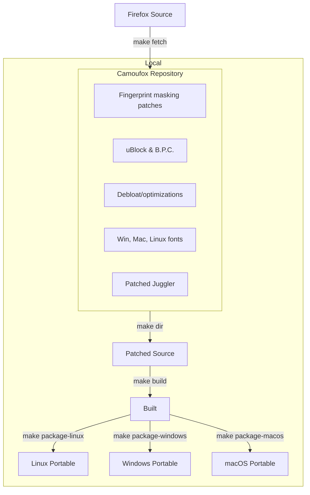
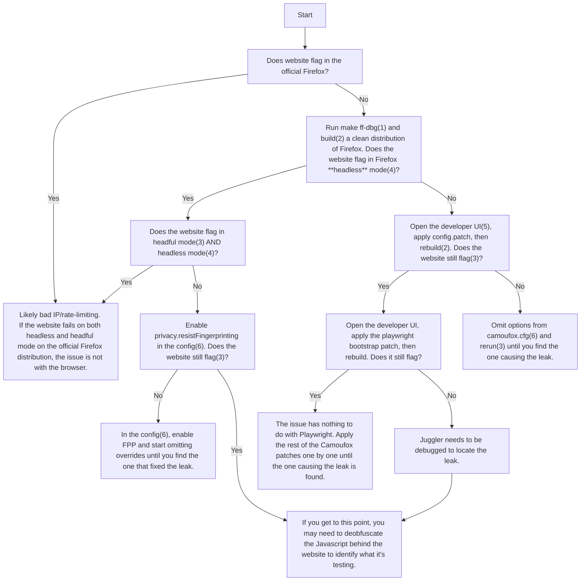

<h1 align="center">Camoufox</h1>

<h4 align="center">A stealthy, minimalistic, custom build of Firefox for web scraping 🦊</h4>

<p align="center">                                      
Camoufox is an open source anti-detect browser for robust fingerprint injection & anti-bot evasion.
</p>

<p align="center">
  <a href="https://ko-fi.com/Z8Z2EFH5A">
    
  </a>
</p>

---

> [!NOTE]
> All of the latest documentation is avaliable at [camoufox.com](https://camoufox.com).

Camoufox is the most modern, effective & future-proof open source solution for avoiding bot detection and intelligent fingerprint rotation. It outperforms most commercial anti-bot browsers.

---

<a href="https://scrapfly.io/?utm_source=github&utm_medium=sponsoring&utm_campaign=camoufox" target="_blank">

</a>

[Scrapfly](https://scrapfly.io/?utm_source=github&utm_medium=sponsoring&utm_campaign=camoufox) is an enterprise-grade solution providing Web Scraping API that aims to simplify the scraping process by managing everything: real browser rendering, rotating proxies, and fingerprints (TLS, HTTP, browser) to bypass all major anti-bots. Scrapfly also unlocks the observability by providing an analytical dashboard and measuring the success rate/block rate in detail.

---

## Features

- Invisible to **all anti-bot systems** 🎭
  - Camoufox performs better than most commerical anti-bot browsers.

* Fingerprint injection & rotation (without JS injection!)
  - All navigator properties (device, OS, hardware, browser, etc.) ✅
  - Screen size, resolution, window, & viewport properties ✅
  - Geolocation, timezone, & locale spoofing ✅
  - Font spoofing & anti-fingerprinting ✅
  - WebGL parameters, supported extensions, context attributes, & shader precision formats ✅
  - WebRTC IP spoofing at the protocol level ✅
  - Media devices, voices, speech playback rate, etc. ✅
  - And much, much more!

- Quality of life features
  - Human-like mouse movement 🖱️
  - Blocks & circumvents ads 🛡️
  - No CSS animations 💨

* Debloated & optimized for memory efficiency ⚡
* [PyPi package](https://pypi.org/project/camoufox/) for updates & auto fingerprint injection 📦
* Stays up to date with the latest Firefox version 🕓

---

## Fingerprint Injection

In Camoufox, data is intercepted at the C++ implementation level, making the changes undetectable through JavaScript inspection.

To spoof fingerprint properties, pass a JSON containing properties to spoof to the [Python interface](https://github.com/daijro/camoufox/tree/main/pythonlib#camoufox-python-interface):

```py
>>> with Camoufox(config={"property": "value"}) as browser:
```

Config data not set by the user will be automatically populated using [BrowserForge](https://github.com/daijro/browserforge) fingerprints, which mimic the statistical distribution of device characteristics in real-world traffic.

<details>
<summary>
Legacy documentation
</summary>

#### The following properties can be spoofed:

<details>
<summary>
Navigator 
</summary>

Navigator properties can be fully spoofed to other Firefox fingerprints, and it is **completely safe**! However, there are some issues when spoofing Chrome (leaks noted).

| Property                       | Notes |
| ------------------------------ | ----- |
| navigator.userAgent            | ✅    |
| navigator.doNotTrack           | ✅    |
| navigator.appCodeName          | ✅    |
| navigator.appName              | ✅    |
| navigator.appVersion           | ✅    |
| navigator.oscpu                | ✅    |
| navigator.language             | ✅    |
| navigator.languages            | ✅    |
| navigator.platform             | ✅    |
| navigator.hardwareConcurrency  | ✅    |
| navigator.product              | ✅    |
| navigator.productSub           | ✅    |
| navigator.maxTouchPoints       | ✅    |
| navigator.cookieEnabled        | ✅    |
| navigator.globalPrivacyControl | ✅    |
| navigator.appVersion           | ✅    |
| navigator.buildID              | ✅    |
| navigator.doNotTrack           | ✅    |

Camoufox will automatically add the following default fonts associated your spoofed User-Agent OS (the value passed in `navigator.userAgent`).

**Notes**:

- **navigator.webdriver** is set to false at all times.
- `navigator.language` & `navigator.languages` will fall back to the `locale:language`/`locale:region` values if not set.
- When spoofing Chrome fingerprints, the following may leak:
  - navigator.userAgentData missing.
  - navigator.deviceMemory missing.
- Changing the presented Firefox version can be detected by some testing websites, but typically will not flag production WAFs.

</details>

<details>
<summary>
Cursor movement
</summary>

### Human-like Cursor movement

Camoufox has built-in support for human-like cursor movement. The natural motion algorithm was originally from [rifosnake's HumanCursor](https://github.com/riflosnake/HumanCursor), but has been rewritten in C++ and modified for more distance-aware trajectories.

### Demo

<video src="https://github.com/user-attachments/assets/6d33d6af-3537-4603-bf24-6bd3f4f8f455" width="500px" autoplay loop muted></video>

### Properties

| Property         | Supported | Description                                                         |
| ---------------- | --------- | ------------------------------------------------------------------- |
| humanize         | ✅        | Enable/disable human-like cursor movement. Defaults to False.       |
| humanize:maxTime | ✅        | Maximum time in seconds for the cursor movement. Defaults to `1.5`. |
| showcursor       | ✅        | Toggles the cursor highlighter. Defaults to True.                   |

**Notes:**

- The cursor highlighter is **not** ran in the page context. It will not be visible to the page. You don't have to worry about it leaking.

</details>

<details>
<summary>
Fonts
</summary>

### Adding Fonts

Fonts can be passed to be used in Camoufox through the `fonts` config property.

By default, Camoufox is bundled with the default Windows 11 22H2 fonts, macOS Sonma fonts, and Linux fonts used in the TOR bundle.

Camoufox will automatically add the default fonts associated your spoofed User-Agent OS (the value passed in `navigator.userAgent`):

- **Mac OS fonts** (from macOS Sonma):

  ```bash
  [".Al Bayan PUA", ".Al Nile PUA", ".Al Tarikh PUA", ".Apple Color Emoji UI", ".Apple SD Gothic NeoI", ".Aqua Kana", ".Aqua Kana Bold", ".Aqua かな", ".Aqua かな ボールド", ".Arial Hebrew Desk Interface", ".Baghdad PUA", ".Beirut PUA", ".Damascus PUA", ".DecoType Naskh PUA", ".Diwan Kufi PUA", ".Farah PUA", ".Geeza Pro Interface", ".Geeza Pro PUA", ".Helvetica LT MM", ".Hiragino Kaku Gothic Interface", ".Hiragino Sans GB Interface", ".Keyboard", ".KufiStandardGK PUA", ".LastResort", ".Lucida Grande UI", ".Muna PUA", ".Nadeem PUA", ".New York", ".Noto Nastaliq Urdu UI", ".PingFang HK", ".PingFang SC", ".PingFang TC", ".SF Arabic", ".SF Arabic Rounded", ".SF Compact", ".SF Compact Rounded", ".SF NS", ".SF NS Mono", ".SF NS Rounded", ".Sana PUA", ".Savoye LET CC.", ".ThonburiUI", ".ThonburiUIWatch", ".苹方-港", ".苹方-简", ".苹方-繁", ".蘋方-港", ".蘋方-簡", ".蘋方-繁", "Academy Engraved LET", "Al Bayan", "Al Nile", "Al Tarikh", "American Typewriter", "Andale Mono", "Apple Braille", "Apple Chancery", "Apple Color Emoji", "Apple SD Gothic Neo", "Apple SD 산돌고딕 Neo", "Apple Symbols", "AppleGothic", "AppleMyungjo", "Arial", "Arial Black", "Arial Hebrew", "Arial Hebrew Scholar", "Arial Narrow", "Arial Rounded MT Bold", "Arial Unicode MS", "Athelas", "Avenir", "Avenir Black", "Avenir Black Oblique", "Avenir Book", "Avenir Heavy", "Avenir Light", "Avenir Medium", "Avenir Next", "Avenir Next Condensed", "Avenir Next Condensed Demi Bold", "Avenir Next Condensed Heavy", "Avenir Next Condensed Medium", "Avenir Next Condensed Ultra Light", "Avenir Next Demi Bold", "Avenir Next Heavy", "Avenir Next Medium", "Avenir Next Ultra Light", "Ayuthaya", "Baghdad", "Bangla MN", "Bangla Sangam MN", "Baskerville", "Beirut", "Big Caslon", "Bodoni 72", "Bodoni 72 Oldstyle", "Bodoni 72 Smallcaps", "Bodoni Ornaments", "Bradley Hand", "Brush Script MT", "Chalkboard", "Chalkboard SE", "Chalkduster", "Charter", "Charter Black", "Cochin", "Comic Sans MS", "Copperplate", "Corsiva Hebrew", "Courier", "Courier New", "Czcionka systemowa", "DIN Alternate", "DIN Condensed", "Damascus", "DecoType Naskh", "Devanagari MT", "Devanagari Sangam MN", "Didot", "Diwan Kufi", "Diwan Thuluth", "Euphemia UCAS", "Farah", "Farisi", "Font Sistem", "Font de sistem", "Font di sistema", "Font sustava", "Fonte do Sistema", "Futura", "GB18030 Bitmap", "Galvji", "Geeza Pro", "Geneva", "Georgia", "Gill Sans", "Grantha Sangam MN", "Gujarati MT", "Gujarati Sangam MN", "Gurmukhi MN", "Gurmukhi MT", "Gurmukhi Sangam MN", "Heiti SC", "Heiti TC", "Heiti-간체", "Heiti-번체", "Helvetica", "Helvetica Neue", "Herculanum", "Hiragino Kaku Gothic Pro", "Hiragino Kaku Gothic Pro W3", "Hiragino Kaku Gothic Pro W6", "Hiragino Kaku Gothic ProN", "Hiragino Kaku Gothic ProN W3", "Hiragino Kaku Gothic ProN W6", "Hiragino Kaku Gothic Std", "Hiragino Kaku Gothic Std W8", "Hiragino Kaku Gothic StdN", "Hiragino Kaku Gothic StdN W8", "Hiragino Maru Gothic Pro", "Hiragino Maru Gothic Pro W4", "Hiragino Maru Gothic ProN", "Hiragino Maru Gothic ProN W4", "Hiragino Mincho Pro", "Hiragino Mincho Pro W3", "Hiragino Mincho Pro W6", "Hiragino Mincho ProN", "Hiragino Mincho ProN W3", "Hiragino Mincho ProN W6", "Hiragino Sans", "Hiragino Sans GB", "Hiragino Sans GB W3", "Hiragino Sans GB W6", "Hiragino Sans W0", "Hiragino Sans W1", "Hiragino Sans W2", "Hiragino Sans W3", "Hiragino Sans W4", "Hiragino Sans W5", "Hiragino Sans W6", "Hiragino Sans W7", "Hiragino Sans W8", "Hiragino Sans W9", "Hoefler Text", "Hoefler Text Ornaments", "ITF Devanagari", "ITF Devanagari Marathi", "Impact", "InaiMathi", "Iowan Old Style", "Iowan Old Style Black", "Järjestelmäfontti", "Kailasa", "Kannada MN", "Kannada Sangam MN", "Kefa", "Khmer MN", "Khmer Sangam MN", "Kohinoor Bangla", "Kohinoor Devanagari", "Kohinoor Gujarati", "Kohinoor Telugu", "Kokonor", "Krungthep", "KufiStandardGK", "Lao MN", "Lao Sangam MN", "Lucida Grande", "Luminari", "Malayalam MN", "Malayalam Sangam MN", "Marion", "Marker Felt", "Menlo", "Microsoft Sans Serif", "Mishafi", "Mishafi Gold", "Monaco", "Mshtakan", "Mukta Mahee", "MuktaMahee Bold", "MuktaMahee ExtraBold", "MuktaMahee ExtraLight", "MuktaMahee Light", "MuktaMahee Medium", "MuktaMahee Regular", "MuktaMahee SemiBold", "Muna", "Myanmar MN", "Myanmar Sangam MN", "Nadeem", "New Peninim MT", "Noteworthy", "Noto Nastaliq Urdu", "Noto Sans Adlam", "Noto Sans Armenian", "Noto Sans Armenian Blk", "Noto Sans Armenian ExtBd", "Noto Sans Armenian ExtLt", "Noto Sans Armenian Light", "Noto Sans Armenian Med", "Noto Sans Armenian SemBd", "Noto Sans Armenian Thin", "Noto Sans Avestan", "Noto Sans Bamum", "Noto Sans Bassa Vah", "Noto Sans Batak", "Noto Sans Bhaiksuki", "Noto Sans Brahmi", "Noto Sans Buginese", "Noto Sans Buhid", "Noto Sans CanAborig", "Noto Sans Canadian Aboriginal", "Noto Sans Carian", "Noto Sans CaucAlban", "Noto Sans Caucasian Albanian", "Noto Sans Chakma", "Noto Sans Cham", "Noto Sans Coptic", "Noto Sans Cuneiform", "Noto Sans Cypriot", "Noto Sans Duployan", "Noto Sans EgyptHiero", "Noto Sans Egyptian Hieroglyphs", "Noto Sans Elbasan", "Noto Sans Glagolitic", "Noto Sans Gothic", "Noto Sans Gunjala Gondi", "Noto Sans Hanifi Rohingya", "Noto Sans HanifiRohg", "Noto Sans Hanunoo", "Noto Sans Hatran", "Noto Sans ImpAramaic", "Noto Sans Imperial Aramaic", "Noto Sans InsPahlavi", "Noto Sans InsParthi", "Noto Sans Inscriptional Pahlavi", "Noto Sans Inscriptional Parthian", "Noto Sans Javanese", "Noto Sans Kaithi", "Noto Sans Kannada", "Noto Sans Kannada Black", "Noto Sans Kannada ExtraBold", "Noto Sans Kannada ExtraLight", "Noto Sans Kannada Light", "Noto Sans Kannada Medium", "Noto Sans Kannada SemiBold", "Noto Sans Kannada Thin", "Noto Sans Kayah Li", "Noto Sans Kharoshthi", "Noto Sans Khojki", "Noto Sans Khudawadi", "Noto Sans Lepcha", "Noto Sans Limbu", "Noto Sans Linear A", "Noto Sans Linear B", "Noto Sans Lisu", "Noto Sans Lycian", "Noto Sans Lydian", "Noto Sans Mahajani", "Noto Sans Mandaic", "Noto Sans Manichaean", "Noto Sans Marchen", "Noto Sans Masaram Gondi", "Noto Sans Meetei Mayek", "Noto Sans Mende Kikakui", "Noto Sans Meroitic", "Noto Sans Miao", "Noto Sans Modi", "Noto Sans Mongolian", "Noto Sans Mro", "Noto Sans Multani", "Noto Sans Myanmar", "Noto Sans Myanmar Blk", "Noto Sans Myanmar ExtBd", "Noto Sans Myanmar ExtLt", "Noto Sans Myanmar Light", "Noto Sans Myanmar Med", "Noto Sans Myanmar SemBd", "Noto Sans Myanmar Thin", "Noto Sans NKo", "Noto Sans Nabataean", "Noto Sans New Tai Lue", "Noto Sans Newa", "Noto Sans Ol Chiki", "Noto Sans Old Hungarian", "Noto Sans Old Italic", "Noto Sans Old North Arabian", "Noto Sans Old Permic", "Noto Sans Old Persian", "Noto Sans Old South Arabian", "Noto Sans Old Turkic", "Noto Sans OldHung", "Noto Sans OldNorArab", "Noto Sans OldSouArab", "Noto Sans Oriya", "Noto Sans Osage", "Noto Sans Osmanya", "Noto Sans Pahawh Hmong", "Noto Sans Palmyrene", "Noto Sans Pau Cin Hau", "Noto Sans PhagsPa", "Noto Sans Phoenician", "Noto Sans PsaPahlavi", "Noto Sans Psalter Pahlavi", "Noto Sans Rejang", "Noto Sans Samaritan", "Noto Sans Saurashtra", "Noto Sans Sharada", "Noto Sans Siddham", "Noto Sans Sora Sompeng", "Noto Sans SoraSomp", "Noto Sans Sundanese", "Noto Sans Syloti Nagri", "Noto Sans Syriac", "Noto Sans Tagalog", "Noto Sans Tagbanwa", "Noto Sans Tai Le", "Noto Sans Tai Tham", "Noto Sans Tai Viet", "Noto Sans Takri", "Noto Sans Thaana", "Noto Sans Tifinagh", "Noto Sans Tirhuta", "Noto Sans Ugaritic", "Noto Sans Vai", "Noto Sans Wancho", "Noto Sans Warang Citi", "Noto Sans Yi", "Noto Sans Zawgyi", "Noto Sans Zawgyi Blk", "Noto Sans Zawgyi ExtBd", "Noto Sans Zawgyi ExtLt", "Noto Sans Zawgyi Light", "Noto Sans Zawgyi Med", "Noto Sans Zawgyi SemBd", "Noto Sans Zawgyi Thin", "Noto Serif Ahom", "Noto Serif Balinese", "Noto Serif Hmong Nyiakeng", "Noto Serif Myanmar", "Noto Serif Myanmar Blk", "Noto Serif Myanmar ExtBd", "Noto Serif Myanmar ExtLt", "Noto Serif Myanmar Light", "Noto Serif Myanmar Med", "Noto Serif Myanmar SemBd", "Noto Serif Myanmar Thin", "Noto Serif Yezidi", "Optima", "Oriya MN", "Oriya Sangam MN", "PT Mono", "PT Sans", "PT Sans Caption", "PT Sans Narrow", "PT Serif", "PT Serif Caption", "Palatino", "Papyrus", "Party LET", "Phosphate", "Phông chữ Hệ thống", "PingFang HK", "PingFang SC", "PingFang TC", "Plantagenet Cherokee", "Police système", "Raanana", "Rendszerbetűtípus", "Rockwell", "STIX Two Math", "STIX Two Text", "STIXGeneral", "STIXIntegralsD", "STIXIntegralsSm", "STIXIntegralsUp", "STIXIntegralsUpD", "STIXIntegralsUpSm", "STIXNonUnicode", "STIXSizeFiveSym", "STIXSizeFourSym", "STIXSizeOneSym", "STIXSizeThreeSym", "STIXSizeTwoSym", "STIXVariants", "STSong", "Sana", "Sathu", "Savoye LET", "Seravek", "Seravek ExtraLight", "Seravek Light", "Seravek Medium", "Shree Devanagari 714", "SignPainter", "SignPainter-HouseScript", "Silom", "Sinhala MN", "Sinhala Sangam MN", "Sistem Fontu", "Skia", "Snell Roundhand", "Songti SC", "Songti TC", "Sukhumvit Set", "Superclarendon", "Symbol", "Systeemlettertype", "System Font", "Systemschrift", "Systemskrift", "Systemtypsnitt", "Systémové písmo", "Tahoma", "Tamil MN", "Tamil Sangam MN", "Telugu MN", "Telugu Sangam MN", "Thonburi", "Times", "Times New Roman", "Tipo de letra del sistema", "Tipo de letra do sistema", "Tipus de lletra del sistema", "Trattatello", "Trebuchet MS", "Verdana", "Waseem", "Webdings", "Wingdings", "Wingdings 2", "Wingdings 3", "Zapf Dingbats", "Zapfino", "Γραμματοσειρά συστήματος", "Системний шрифт", "Системный шрифт", "גופן מערכת", "البيان", "التاريخ", "النيل", "بغداد", "بيروت", "جيزة", "خط النظام", "دمشق", "ديوان ثلث", "ديوان كوفي", "صنعاء", "فارسي", "فرح", "كوفي", "منى", "مِصحفي", "مِصحفي ذهبي", "نديم", "نسخ", "وسيم", "आई॰टी॰एफ़॰ देवनागरी", "आई॰टी॰एफ़॰ देवनागरी मराठी", "कोहिनूर देवनागरी", "देवनागरी एम॰टी॰", "देवनागरी संगम एम॰एन॰", "श्री देवनागरी ७१४", "แบบอักษรระบบ", "⹁煵愠芩苈", "システムフォント", "ヒラギノ丸ゴ Pro", "ヒラギノ丸ゴ Pro W4", "ヒラギノ丸ゴ ProN", "ヒラギノ丸ゴ ProN W4", "ヒラギノ明朝 Pro", "ヒラギノ明朝 Pro W3", "ヒラギノ明朝 Pro W6", "ヒラギノ明朝 ProN", "ヒラギノ明朝 ProN W3", "ヒラギノ明朝 ProN W6", "ヒラギノ角ゴ Pro", "ヒラギノ角ゴ Pro W3", "ヒラギノ角ゴ Pro W6", "ヒラギノ角ゴ ProN", "ヒラギノ角ゴ ProN W3", "ヒラギノ角ゴ ProN W6", "ヒラギノ角ゴ Std", "ヒラギノ角ゴ Std W8", "ヒラギノ角ゴ StdN", "ヒラギノ角ゴ StdN W8", "ヒラギノ角ゴ 簡体中文", "ヒラギノ角ゴ 簡体中文 W3", "ヒラギノ角ゴ 簡体中文 W6", "ヒラギノ角ゴシック", "ヒラギノ角ゴシック W0", "ヒラギノ角ゴシック W1", "ヒラギノ角ゴシック W2", "ヒラギノ角ゴシック W3", "ヒラギノ角ゴシック W4", "ヒラギノ角ゴシック W5", "ヒラギノ角ゴシック W6", "ヒラギノ角 ゴシック W7", "ヒラギノ角ゴシック W8", "ヒラギノ角ゴシック W9", "冬青黑体简体中文", "冬青黑体简体中文 W3", "冬青黑体简体中文 W6", "冬青黑體簡體中文", "冬青黑體簡體中文 W3", "冬青黑體簡體中文 W6", "宋体-简", "宋体-繁", "宋體-簡", "宋體-繁", "系統字體", "系统字体", "苹方-港", "苹方-简", "苹方-繁", "荱莉荍荭詰荓⁐牯", "荱莉荍荭詰荓⁓瑤", "荱莉荍荭詰荓荖荢荎", "荱莉荍荭諛荓⁐牯", "荱莉荍荭难銩⁐牯", "蘋方-港", "蘋方-簡", "蘋方-繁", "黑体-简", "黑体-繁", "黑體-簡", "黑體-繁", "黒体-簡", "黒体-繁", "시스템 서체"]
  ```

- **Windows fonts** (from Windows 11 22H2):

  ```bash
  ["Arial", "Arial Black", "Bahnschrift", "Calibri", "Calibri Light", "Cambria", "Cambria Math", "Candara", "Candara Light", "Comic Sans MS", "Consolas", "Constantia", "Corbel", "Corbel Light", "Courier New", "Ebrima", "Franklin Gothic Medium", "Gabriola", "Gadugi", "Georgia", "HoloLens MDL2 Assets", "Impact", "Ink Free", "Javanese Text", "Leelawadee UI", "Leelawadee UI Semilight", "Lucida Console", "Lucida Sans Unicode", "MS Gothic", "MS PGothic", "MS UI Gothic", "MV Boli", "Malgun Gothic", "Malgun Gothic Semilight", "Marlett", "Microsoft Himalaya", "Microsoft JhengHei", "Microsoft JhengHei Light", "Microsoft JhengHei UI", "Microsoft JhengHei UI Light", "Microsoft New Tai Lue", "Microsoft PhagsPa", "Microsoft Sans Serif", "Microsoft Tai Le", "Microsoft YaHei", "Microsoft YaHei Light", "Microsoft YaHei UI", "Microsoft YaHei UI Light", "Microsoft Yi Baiti", "MingLiU-ExtB", "MingLiU_HKSCS-ExtB", "Mongolian Baiti", "Myanmar Text", "NSimSun", "Nirmala UI", "Nirmala UI Semilight", "PMingLiU-ExtB", "Palatino Linotype", "Segoe Fluent Icons", "Segoe MDL2 Assets", "Segoe Print", "Segoe Script", "Segoe UI", "Segoe UI Black", "Segoe UI Emoji", "Segoe UI Historic", "Segoe UI Light", "Segoe UI Semibold", "Segoe UI Semilight", "Segoe UI Symbol", "Segoe UI Variable", "SimSun", "SimSun-ExtB", "Sitka", "Sitka Text", "Sylfaen", "Symbol", "Tahoma", "Times New Roman", "Trebuchet MS", "Twemoji Mozilla", "Verdana", "Webdings", "Wingdings", "Yu Gothic", "Yu Gothic Light", "Yu Gothic Medium", "Yu Gothic UI", "Yu Gothic UI Light", "Yu Gothic UI Semibold", "Yu Gothic UI Semilight", "宋体", "微軟正黑體", "微軟正黑體 Light", "微软雅黑", "微软雅黑 Light", "新宋体", "新細明體-ExtB", "游ゴシック", "游ゴシック Light", "游ゴシック Medium", "細明體-ExtB", "細明體_HKSCS-ExtB", "맑은 고딕", "맑은 고딕 Semilight", "ＭＳ ゴシック", "ＭＳ Ｐゴシック"]
  ```

- **Linux fonts** (from TOR Browser):

  ```bash
  ["Arimo", "Cousine", "Noto Naskh Arabic", "Noto Sans Adlam", "Noto Sans Armenian", "Noto Sans Balinese", "Noto Sans Bamum", "Noto Sans Bassa Vah", "Noto Sans Batak", "Noto Sans Bengali", "Noto Sans Buginese", "Noto Sans Buhid", "Noto Sans Canadian Aboriginal", "Noto Sans Chakma", "Noto Sans Cham", "Noto Sans Cherokee", "Noto Sans Coptic", "Noto Sans Deseret", "Noto Sans Devanagari", "Noto Sans Elbasan", "Noto Sans Ethiopic", "Noto Sans Georgian", "Noto Sans Grantha", "Noto Sans Gujarati", "Noto Sans Gunjala Gondi", "Noto Sans Gurmukhi", "Noto Sans Hanifi Rohingya", "Noto Sans Hanunoo", "Noto Sans Hebrew", "Noto Sans JP", "Noto Sans Javanese", "Noto Sans KR", "Noto Sans Kannada", "Noto Sans Kayah Li", "Noto Sans Khmer", "Noto Sans Khojki", "Noto Sans Khudawadi", "Noto Sans Lao", "Noto Sans Lepcha", "Noto Sans Limbu", "Noto Sans Lisu", "Noto Sans Mahajani", "Noto Sans Malayalam", "Noto Sans Mandaic", "Noto Sans Masaram Gondi", "Noto Sans Medefaidrin", "Noto Sans Meetei Mayek", "Noto Sans Mende Kikakui", "Noto Sans Miao", "Noto Sans Modi", "Noto Sans Mongolian", "Noto Sans Mro", "Noto Sans Multani", "Noto Sans Myanmar", "Noto Sans NKo", "Noto Sans New Tai Lue", "Noto Sans Newa", "Noto Sans Ol Chiki", "Noto Sans Oriya", "Noto Sans Osage", "Noto Sans Osmanya", "Noto Sans Pahawh Hmong", "Noto Sans Pau Cin Hau", "Noto Sans Rejang", "Noto Sans Runic", "Noto Sans SC", "Noto Sans Samaritan", "Noto Sans Saurashtra", "Noto Sans Sharada", "Noto Sans Shavian", "Noto Sans Sinhala", "Noto Sans Sora Sompeng", "Noto Sans Soyombo", "Noto Sans Sundanese", "Noto Sans Syloti Nagri", "Noto Sans Symbols", "Noto Sans Symbols 2", "Noto Sans Syriac", "Noto Sans TC", "Noto Sans Tagalog", "Noto Sans Tagbanwa", "Noto Sans Tai Le", "Noto Sans Tai Tham", "Noto Sans Tai Viet", "Noto Sans Takri", "Noto Sans Tamil", "Noto Sans Telugu", "Noto Sans Thaana", "Noto Sans Thai", "Noto Sans Tifinagh", "Noto Sans Tifinagh APT", "Noto Sans Tifinagh Adrar", "Noto Sans Tifinagh Agraw Imazighen", "Noto Sans Tifinagh Ahaggar", "Noto Sans Tifinagh Air", "Noto Sans Tifinagh Azawagh", "Noto Sans Tifinagh Ghat", "Noto Sans Tifinagh Hawad", "Noto Sans Tifinagh Rhissa Ixa", "Noto Sans Tifinagh SIL", "Noto Sans Tifinagh Tawellemmet", "Noto Sans Tirhuta", "Noto Sans Vai", "Noto Sans Wancho", "Noto Sans Warang Citi", "Noto Sans Yi", "Noto Sans Zanabazar Square", "Noto Serif Armenian", "Noto Serif Balinese", "Noto Serif Bengali", "Noto Serif Devanagari", "Noto Serif Dogra", "Noto Serif Ethiopic", "Noto Serif Georgian", "Noto Serif Grantha", "Noto Serif Gujarati", "Noto Serif Gurmukhi", "Noto Serif Hebrew", "Noto Serif Kannada", "Noto Serif Khmer", "Noto Serif Khojki", "Noto Serif Lao", "Noto Serif Malayalam", "Noto Serif Myanmar", "Noto Serif NP Hmong", "Noto Serif Sinhala", "Noto Serif Tamil", "Noto Serif Telugu", "Noto Serif Thai", "Noto Serif Tibetan", "Noto Serif Yezidi", "STIX Two Math", "Tinos", "Twemoji Mozilla"]
  ```

Other fonts can be added by copying them into the `fonts/` directory in Camoufox, or by installing them on your system.

**Note**: It is highly recommended that you randomly pass custom fonts to the `fonts` config property to avoid font fingerprinting!

### Font Metrics

Camoufox has a built in mechanism to prevent fingerprinting by font metrics & unicode glyphs:


This works by shifting the spacing of each letter by a random value between 0-0.1px.

</details>

<details>
<summary>
Screen
</summary>

| Property           | Status |
| ------------------ | ------ |
| screen.availHeight | ✅     |
| screen.availWidth  | ✅     |
| screen.availTop    | ✅     |
| screen.availLeft   | ✅     |
| screen.height      | ✅     |
| screen.width       | ✅     |
| screen.colorDepth  | ✅     |
| screen.pixelDepth  | ✅     |
| screen.pageXOffset | ✅     |
| screen.pageYOffset | ✅     |

**Notes:**

- `screen.colorDepth` and `screen.pixelDepth` are synonymous.

</details>

<details>
<summary>
Window
</summary>

| Property                | Status | Notes                           |
| ----------------------- | ------ | ------------------------------- |
| window.scrollMinX       | ✅     |
| window.scrollMinY       | ✅     |
| window.scrollMaxX       | ✅     |
| window.scrollMaxY       | ✅     |
| window.outerHeight      | ✅     | Sets the window height.         |
| window.outerWidth       | ✅     | Sets the window width.          |
| window.innerHeight      | ✅     | Sets the inner viewport height. |
| window.innerWidth       | ✅     | Sets the inner viewport width.  |
| window.screenX          | ✅     |
| window.screenY          | ✅     |
| window.history.length   | ✅     |
| window.devicePixelRatio | ✅     | Works, but not recommended.     |

**Notes:**

- Setting the outer window viewport will cause some cosmetic defects to the Camoufox window if the user attempts to manually resize it. Under no circumstances will Camoufox allow the outer window viewport to be resized.

</details>

<details>
<summary>
Document
</summary>

Spoofing document.body has been implemented, but it is more advicable to set `window.innerWidth` and `window.innerHeight` instead.

| Property                   | Status |
| -------------------------- | ------ |
| document.body.clientWidth  | ✅     |
| document.body.clientHeight | ✅     |
| document.body.clientTop    | ✅     |
| document.body.clientLeft   | ✅     |

</details>

<details>
<summary>
HTTP Headers
</summary>

Camoufox can override the following network headers:

| Property                | Status |
| ----------------------- | ------ |
| headers.User-Agent      | ✅     |
| headers.Accept-Language | ✅     |
| headers.Accept-Encoding | ✅     |

**Notes:**

- If `headers.User-Agent` is not set, it will fall back to `navigator.userAgent`.

</details>

<details>
<summary>
Geolocation & Intl
</summary>

| Property              | Status | Description                                                                                                                                            | Required Keys           |
| --------------------- | ------ | ------------------------------------------------------------------------------------------------------------------------------------------------------ | ----------------------- |
| geolocation:latitude  | ✅     | Latitude to use.                                                                                                                                       | `geolocation:longitude` |
| geolocation:longitude | ✅     | Longitude to use.                                                                                                                                      | `geolocation:latitude`  |
| geolocation:accuracy  | ✅     | Accuracy in meters. This will be calculated automatically using the decminal percision of `geolocation:latitude` & `geolocation:longitude` if not set. |                         |
| timezone              | ✅     | Set a custom TZ timezone (e.g. "America/Chicago"). This will also change `Date()` to return the local time.                                            |                         |
| locale:language       | ✅     | Spoof the Intl API, headers, and system language (e.g. "en")                                                                                           | `locale:region`         |
| locale:region         | ✅     | Spoof the Intl API, headers, and system region (e.g. "US").                                                                                            | `locale:language`       |
| locale:script         | ✅     | Set a custom script (e.g. "Latn"). Will be set automatically if not specified.                                                                         |                         |

The **Required Keys** are keys that must also be set for the property to work.

**Notes:**

- Location permission prompts will be accepted automatically if `geolocation:latitude` and `geolocation:longitude` are set.
- `timezone` **must** be set to a valid TZ identifier. See [here](https://en.wikipedia.org/wiki/List_of_tz_database_time_zones) for a list of valid timezones.
- `locale:language` & `locale:region` **must** be set to valid locale values. See [here](https://simplelocalize.io/data/locales/) for a list of valid locale-region values.

</details>

<details>
<summary>
WebRTC IP
</summary>

Camoufox implements WebRTC IP spoofing at the protocol level by modifying ICE candidates and SDP before they're sent.

| Property    | Status | Description         |
| ----------- | ------ | ------------------- |
| webrtc:ipv4 | ✅     | IPv4 address to use |
| webrtc:ipv6 | ✅     | IPv6 address to use |

**Notes:**

- To completely disable WebRTC, set the `media.peerconnection.enabled` preference to `false`.

</details>

<details>
<summary>
WebGL
</summary>

### WebGL in Camoufox

WebGL is disabled in Camoufox by default. To enable it, set the `webgl.disabled` Firefox preference to `false`.

WebGL being disabled typically doesn't trigger detection by WAFs, so you generally don't need to be concerned about it. Only use WebGL when it's absolutely necessary for your specific use case.

Because I don't have a dataset of WebGL fingerprints to rotate against, WebGL fingerprint rotation is not implemented in the Camoufox Python library. If you need to spoof WebGL, you can do so manually with the following properties.

### Demo site

This repository includes a demo site (see [here](https://github.com/daijro/camoufox/blob/main/scripts/examples/webgl.html)) that prints your browser's WebGL parameters. You can use this site to generate WebGL fingerprints for Camoufox from other devices.


### Properties

Camoufox supports spoofing WebGL parameters, supported extensions, context attributes, and shader precision formats.

**Note**: Do NOT randomly assign values to these properties. WAFs hash your WebGL fingerprint and compare it against a dataset. Randomly assigning values will lead to detection as an unknown device.

| Property                                        | Description                                                                                                           | Example                                                                                 |
| ----------------------------------------------- | --------------------------------------------------------------------------------------------------------------------- | --------------------------------------------------------------------------------------- |
| webGl:renderer                                  | Spoofs the name of the unmasked WebGL renderer.                                                                       | `"NVIDIA GeForce GTX 980, or similar"`                                                  |
| webGl:vendor                                    | Spoofs the name of the unmasked WebGL vendor.                                                                         | `"NVIDIA Corporation"`                                                                  |
| webGl:supportedExtensions                       | An array of supported WebGL extensions ([full list](https://registry.khronos.org/webgl/extensions/)).                 | `["ANGLE_instanced_arrays", "EXT_color_buffer_float", "EXT_disjoint_timer_query", ...]` |
| webGl2:supportedExtensions                      | The same as `webGl:supportedExtensions`, but for WebGL2.                                                              | `["ANGLE_instanced_arrays", "EXT_color_buffer_float", "EXT_disjoint_timer_query", ...]` |
| webGl:contextAttributes                         | A dictionary of WebGL context attributes.                                                                             | `{"alpha": true, "antialias": true, "depth": true, ...}`                                |
| webGl2:contextAttributes                        | The same as `webGl:contextAttributes`, but for WebGL2.                                                                | `{"alpha": true, "antialias": true, "depth": true, ...}`                                |
| webGl:parameters                                | A dictionary of WebGL parameters. Keys must be GL enums, and values are the values to spoof them as.                  | `{"2849": 1, "2884": false, "2928": [0, 1], ...}`                                       |
| webGl2:parameters                               | The same as `webGl:parameters`, but for WebGL2.                                                                       | `{"2849": 1, "2884": false, "2928": [0, 1], ...}`                                       |
| webGl:parameters:blockIfNotDefined              | If set to `true`, only the parameters in `webGl:parameters` will be allowed. Can be dangerous if not used correctly.  | `true`/`false`                                                                          |
| webGl2:parameters:blockIfNotDefined             | If set to `true`, only the parameters in `webGl2:parameters` will be allowed. Can be dangerous if not used correctly. | `true`/`false`                                                                          |
| webGl:shaderPrecisionFormats                    | A dictionary of WebGL shader precision formats. Keys are formatted as `"<shaderType>,<precisionType>"`.               | `{"35633,36336": {"rangeMin": 127, "rangeMax": 127, "precision": 23}, ...}`             |
| webGl2:shaderPrecisionFormats                   | The same as `webGL:shaderPrecisionFormats`, but for WebGL2.                                                           | `{"35633,36336": {"rangeMin": 127, "rangeMax": 127, "precision": 23}, ...}`             |
| webGl:shaderPrecisionFormats:blockIfNotDefined  | If set to `true`, only the shader percisions in `webGl:shaderPrecisionFormats` will be allowed.                       | `true`/`false`                                                                          |
| webGl2:shaderPrecisionFormats:blockIfNotDefined | If set to `true`, only the shader percisions in `webGl2:shaderPrecisionFormats` will be allowed.                      | `true`/`false`                                                                          |

</details>

<details>
<summary>
AudioContext
</summary>

Camoufox can spoof the AudioContext sample rate, output latency, and max channel count.

| Property                     | Status | Description                                |
| ---------------------------- | ------ | ------------------------------------------ |
| AudioContext:sampleRate      | ✅     | Spoofs the AudioContext sample rate.       |
| AudioContext:outputLatency   | ✅     | Spoofs the AudioContext output latency.    |
| AudioContext:maxChannelCount | ✅     | Spoofs the AudioContext max channel count. |

Here is a testing site: https://audiofingerprint.openwpm.com/

</details>

<details>
<summary>
Addons
</summary>

In the Camoufox Python library, addons can be loaded with the `addons` parameter:

```python
from camoufox.sync_api import Camoufox

with Camoufox(addons=['/path/to/addon', '/path/to/addon2']) as browser:
    page = browser.new_page()
```

Camoufox will automatically download and use the latest uBlock Origin with custom privacy/adblock filters, and B.P.C. by default to help with ad circumvention.

You can also exclude default addons with the `exclude_addons` parameter:

```python
from camoufox.sync_api import Camoufox
from camoufox import DefaultAddons

with Camoufox(exclude_addons=[DefaultAddons.UBO, DefaultAddons.BPC]) as browser:
    page = browser.new_page()
```

<details>
<summary>
Loading addons with the legacy launcher...
</summary>

Addons can be loaded with the `--addons` flag.

Example:

```bash
./launcher --addons '["/path/to/addon", "/path/to/addon2"]'
```

Camoufox will automatically download and use the latest uBlock Origin with custom privacy/adblock filters, and B.P.C. by default to help with scraping.

You can also exclude default addons with the `--exclude-addons` flag:

```bash
./launcher --exclude-addons '["uBO", "BPC"]'
```

</details>

---

</details>

<details>
<summary>
Miscellaneous (battery status, etc)
</summary>

| Property                | Status | Description                                                                                                                     |
| ----------------------- | ------ | ------------------------------------------------------------------------------------------------------------------------------- |
| pdfViewer               | ✅     | Sets navigator.pdfViewerEnabled. Please keep this on though, many websites will flag a lack of pdfViewer as a headless browser. |
| battery:charging        | ✅     | Spoofs the battery charging status.                                                                                             |
| battery:chargingTime    | ✅     | Spoofs the battery charging time.                                                                                               |
| battery:dischargingTime | ✅     | Spoofs the battery discharging time.                                                                                            |
| battery:level           | ✅     | Spoofs the battery level.                                                                                                       |

</details>

</details>

<hr width=50>

## Patches

### What changes were made?

#### Fingerprint spoofing

- Navigator properties spoofing (device, browser, locale, etc.)
- Support for emulating screen size, resolution, etc.
- Spoof WebGL parameters, supported extensions, context attributes, and shader precision formats.
- Spoof inner and outer window viewport sizes
- Spoof AudioContext sample rate, output latency, and max channel count
- Spoof device voices & playback rates
- Network headers (Accept-Languages and User-Agent) are spoofed to match the navigator properties
- WebRTC IP spoofing at the protocol level
- Geolocation, timezone, and locale spoofing
- Battery API spoofing
- etc.

#### Stealth patches

- Avoids main world execution leaks. All page agent javascript is sandboxed
- Avoids frame execution context leaks
- Fixes `navigator.webdriver` detection
- Fixes Firefox headless detection via pointer type ([#26](https://github.com/daijro/camoufox/issues/26))
- Removed potentially leaking anti-zoom/meta viewport handling patches
- Uses non-default screen & window sizes
- Re-enable fission content isolations
- Re-enable PDF.js
- Other leaking config properties changed

#### Anti font fingerprinting

- Automatically uses the correct system fonts for your User Agent
- Bundled with Windows, Mac, and Linux system fonts
- Prevents font metrics fingerprinting by randomly offsetting letter spacing

#### Playwright support

- Custom implementation of Playwright for the latest Firefox
- Various config patches to evade bot detection

#### Debloat/Optimizations

- Stripped out/disabled _many, many_ Mozilla services. Runs faster than the original Mozilla Firefox, and uses less memory (200mb)
- Patches from LibreWolf & Ghostery to help remove telemetry & bloat
- Debloat config from PeskyFox, LibreWolf, and others
- Speed & network optimizations from FastFox
- Removed all CSS animations
- Minimalistic theming
- etc.

#### Addons

- Firefox addons can be loaded with the `--addons` flag
- Added uBlock Origin with custom privacy filters
- Addons are not allowed to open tabs
- Addons are automatically enabled in Private Browsing mode
- Addons are automatically pinned to the toolbar
- Fixes DNS leaks with uBO prefetching

## Stealth Performance

In Camoufox, all of Playwright's internal Page Agent Javascript is sandboxed and isolated.
This makes it **impossible** for a page to detect the presence of Playwright through Javascript inspection.

### Tests

Camoufox performs well against every major WAF I've tested. (Original test sites from [Botright](https://github.com/Vinyzu/botright/?tab=readme-ov-file#browser-stealth))

| Test                                                                                               | Status                                                    |
| -------------------------------------------------------------------------------------------------- | --------------------------------------------------------- |
| [**CreepJS**](https://abrahamjuliot.github.io/creepjs/)                                            | ✔️ 71.5%. Successfully spoofs all OS predictions.         |
| [**Rebrowser Bot Detector**](https://bot-detector.rebrowser.net/)                                  | ✔️ All tests pass.                                        |
| [**BrowserScan**](https://browserscan.net/)                                                        | ✔️ 100%. Spoofs all geolocation & locale proxy detection. |
| **reCaptcha Score**                                                                                | ✔️                                                        |
| ‣ [nopecha.com](https://nopecha.com/demo/recaptcha)                                                | ✔️                                                        |
| ‣ [recaptcha-demo.appspot.com](https://recaptcha-demo.appspot.com/recaptcha-v3-request-scores.php) | ✔️ 0.9                                                    |
| ‣ [berstend.github.io](https://berstend.github.io/static/recaptcha/v3-programmatic.html)           | ✔️ 0.9                                                    |
| **DataDome**                                                                                       | ✔️                                                        |
| ‣ [DataDome bot bounty](https://yeswehack.com/programs/datadome-bot-bounty#program-description)    | ✔️ All test sites pass.                                   |
| ‣ [hermes.com](https://www.hermes.com/us/en/)                                                      | ✔️                                                        |
| **Imperva**                                                                                        | ✔️                                                        |
| ‣ [ticketmaster.es](https://www.ticketmaster.es/)                                                  | ✔️                                                        |
| **Cloudflare**                                                                                     | ✔️                                                        |
| ‣ [Turnstile](https://nopecha.com/demo/turnstile)                                                  | ✔️                                                        |
| ‣ [Interstitial](https://nopecha.com/demo/cloudflare)                                              | ✔️                                                        |
| **WebRTC IP Spoofing**                                                                             | ✔️                                                        |
| ‣ [Browserleaks WebRTC](https://browserleaks.net/webrtc)                                           | ✔️ Spoofs public IP correctly.                            |
| ‣ [CreepJS WebRTC](https://abrahamjuliot.github.io/creepjs/)                                       | ✔️ Spoofs Host & STUN IP correctly.                       |
| ‣ [BrowserScan WebRTC](https://www.browserscan.net/webrtc)                                         | ✔️ Spoofs Host & STUN IP correctly.                       |
| **Font Fingerprinting**                                                                            | ✔️                                                        |
| ‣ [Browserleaks Fonts](https://browserleaks.net/fonts)                                             | ✔️ Rotates all metrics.                                   |
| ‣ [CreepJS TextMetrics](https://abrahamjuliot.github.io/creepjs/tests/fonts.html)                  | ✔️ Rotates all metrics.                                   |
| [**Incolumitas**](https://bot.incolumitas.com/)                                                    | ✔️ 0.8-1.0                                                |
| [**SannySoft**](https://bot.sannysoft.com/)                                                        | ✔️                                                        |
| [**Fingerprint.com**](https://fingerprint.com/products/bot-detection/)                             | ✔️                                                        |
| [**IpHey**](https://iphey.com/)                                                                    | ✔️                                                        |
| [**Bet365**](https://www.bet365.com/#/AC/B1/C1/D1002/E79147586/G40/)                               | ✔️                                                        |

Camoufox does **not** fully support injecting Chromium fingerprints. Some WAFs (such as [Interstitial](https://nopecha.com/demo/cloudflare)) test for Spidermonkey engine behavior, which is impossible to spoof.

## Playwright Usage

#### See [here](https://github.com/daijro/camoufox/tree/main/pythonlib#camoufox-python-interface) for documentation on Camoufox's Python interface.

It is strongly recommended to use the Camoufox Python library instead of the legacy launcher, which is now deprecated.

<details>
<summary>
See legacy launcher usage (deprecated)
</summary>

Camoufox is fully compatible with your existing Playwright code. You only have to change your browser initialization:

```py
browser = pw.firefox.launch(
  executable_path='/path/to/camoufox/launch',  # Path to the Camoufox launcher
  args=['--config', '/path/to/config.json'],   # File path or JSON string
)
```

<details>
<summary>
See full example script...
</summary>

```py
import asyncio
import json
from playwright.async_api import async_playwright

# Example config
CONFIG = {
 'window.outerHeight': 1056,
 'window.outerWidth': 1920,
 'window.innerHeight': 1008,
 'window.innerWidth': 1920,
 'window.history.length': 4,
 'navigator.userAgent': 'Mozilla/5.0 (Windows NT 10.0; Win64; x64; rv:125.0) Gecko/20100101 Firefox/125.0',
 'navigator.appCodeName': 'Mozilla',
 'navigator.appName': 'Netscape',
 'navigator.appVersion': '5.0 (Windows)',
 'navigator.oscpu': 'Windows NT 10.0; Win64; x64',
 'navigator.language': 'en-US',
 'navigator.languages': ['en-US'],
 'navigator.platform': 'Win32',
 'navigator.hardwareConcurrency': 12,
 'navigator.product': 'Gecko',
 'navigator.productSub': '20030107',
 'navigator.maxTouchPoints': 10,
}

async def main():
    async with async_playwright() as p:
        # Create a Firefox instance to the launcher
        browser = await p.firefox.launch(
          # Pass in the Camoufox launcher and config JSON
          executable_path='/path/to/camoufox/launch',
          args=['--config', json.dumps(CONFIG)],
          # Launch in headful mode
          headless=False
        )
        # Continue as normal
        page = await browser.new_page()
        await page.goto('https://abrahamjuliot.github.io/creepjs/')
        await asyncio.sleep(10)
        await browser.close()

if __name__ == "__main__":
    asyncio.run(main())
```

</details>
</details>

---

> [!NOTE]
> The content below is intended for those interested in building & debugging Camoufox. For Playwright usage instructions, see [here](https://github.com/daijro/camoufox/tree/main/pythonlib#camoufox-python-interface).

<h1 align="center">Build System</h1>

### Overview

Here is a diagram of the build system, and its associated make commands:



This was originally based on the LibreWolf build system.

## Build CLI

> [!WARNING]
> Camoufox's build system is designed to be used in Linux. WSL will not work!

First, clone this repository with Git:

```bash
git clone --depth 1 https://github.com/daijro/camoufox
cd camoufox
```

Next, build the Camoufox source code with the following command:

```bash
make dir
```

After that, you have to bootstrap your system to be able to build Camoufox. You only have to do this one time. It is done by running the following command:

```bash
make bootstrap
```

Finally you can build and package Camoufox the following command:

```bash
python3 multibuild.py --target linux windows macos --arch x86_64 arm64 i686
```

<details>
<summary>
CLI Parameters
</summary>

```bash
Options:
  -h, --help            show this help message and exit
  --target {linux,windows,macos} [{linux,windows,macos} ...]
                        Target platforms to build
  --arch {x86_64,arm64,i686} [{x86_64,arm64,i686} ...]
                        Target architectures to build for each platform
  --bootstrap           Bootstrap the build system
  --clean               Clean the build directory before starting

Example:
$ python3 multibuild.py --target linux windows macos --arch x86_64 arm64
```

</details>

### Using Docker

Camoufox can be built through Docker on all platforms.

1. Create the Docker image containing Firefox's source code:

```bash
docker build -t camoufox-builder .
```

2. Build Camoufox patches to a target platform and architecture:

```bash
docker run -v "$(pwd)/dist:/app/dist" camoufox-builder --target <os> --arch <arch>
```

<details>
<summary>
How can I use my local ~/.mozbuild directory?
</summary>

If you want to use the host's .mozbuild directory, you can use the following command instead to run the docker:

```bash
docker run \
  -v "$HOME/.mozbuild":/root/.mozbuild:rw,z \
  -v "$(pwd)/dist:/app/dist" \
  camoufox-builder \
  --target <os> \
  --arch <arch>
```

</details>

<details>
<summary>
Docker CLI Parameters
</summary>

```bash
Options:
  -h, --help            show this help message and exit
  --target {linux,windows,macos} [{linux,windows,macos} ...]
                        Target platforms to build
  --arch {x86_64,arm64,i686} [{x86_64,arm64,i686} ...]
                        Target architectures to build for each platform
  --bootstrap           Bootstrap the build system
  --clean               Clean the build directory before starting

Example:
$ docker run -v "$(pwd)/dist:/app/dist" camoufox-builder --target windows macos linux --arch x86_64 arm64 i686
```

</details>

Build artifacts will now appear written under the `dist/` folder.

---

## Development Tools

This repo comes with a developer UI under scripts/developer.py:

```
make edits
```

Patches can be edited, created, removed, and managed through here.


### How to make a patch

1. In the developer UI, click **Reset workspace**.
2. Make changes in the `camoufox-*/` folder as needed. You can test your changes with `make build` and `make run`.
3. After you're done making changes, click **Write workspace to patch** and save the patch file.

### How to work on an existing patch

1. In the developer UI, click **Edit a patch**.
2. Select the patch you'd like to edit. Your workspace will be reset to the state of the selected patch.
3. After you're done making changes, hit **Write workspace to patch** and overwrite the existing patch file.

---

## Leak Debugging

This is a flow chart demonstrating my process for determining leaks without deobfuscating WAF Javascript. The method incrementally reintroduces Camoufox's features into Firefox's source code until the testing site flags.

This process requires a Linux system and assumes you have Firefox build tools installed (see [here](https://github.com/daijro/camoufox?tab=readme-ov-file#build-cli)).

<details>
<summary>
See flow chart...
</summary>



#### Cited Commands

| #   | Command                                       | Description                                                                                                 |
| --- | --------------------------------------------- | ----------------------------------------------------------------------------------------------------------- |
| (1) | `make ff-dbg`                                 | Setup vanilla Firefox with minimal patches.                                                                 |
| (2) | `make build`                                  | Build the source code.                                                                                      |
| (3) | `make run`                                    | Runs the built browser.                                                                                     |
| (4) | `make run args="--headless https://test.com"` | Run a URL in headless mode. All redirects will be printed to the console to determine if the test passed.   |
| (5) | `make edits`                                  | Opens the developer UI. Allows the user to apply/undo patches, and see which patches are currently applied. |
| (6) | `make edit-cfg`                               | Edit camoufox.cfg in the default system editor.                                                             |

</details>

---

## Thanks

- [LibreWolf](https://gitlab.com/librewolf-community/browser/source) - Debloat patches & build system inspiration
- [BetterFox](https://github.com/yokoffing/BetterFox) - Debloat & optimizations
- [Ghostery](https://github.com/ghostery/user-agent-desktop) - Debloat reference
- [TOR Browser](https://2019.www.torproject.org/projects/torbrowser/design/) - Anti fingerprinting reference
- [Jamir-boop/minimalisticfox](https://github.com/Jamir-boop/minimalisticfox) - Inspired Camoufox's minimalistic theming
- [nicoth-in/Dark-Space-Theme](https://github.com/nicoth-in/Dark-Space-Theme) - Camoufox's dark theme
- [Playwright](https://github.com/microsoft/playwright/tree/main/browser_patches/firefox), [Puppeteer/Juggler](https://github.com/puppeteer/juggler) - Original Juggler implementation
- [CreepJS](https://github.com/abrahamjuliot/creepjs), [Browserleaks](https://browserleaks.com), [BrowserScan](https://www.browserscan.net/) - Valuable leak testing sites
- [riflosnake/HumanCursor](https://github.com/riflosnake/HumanCursor) - Original human-like cursor movement algorithm
