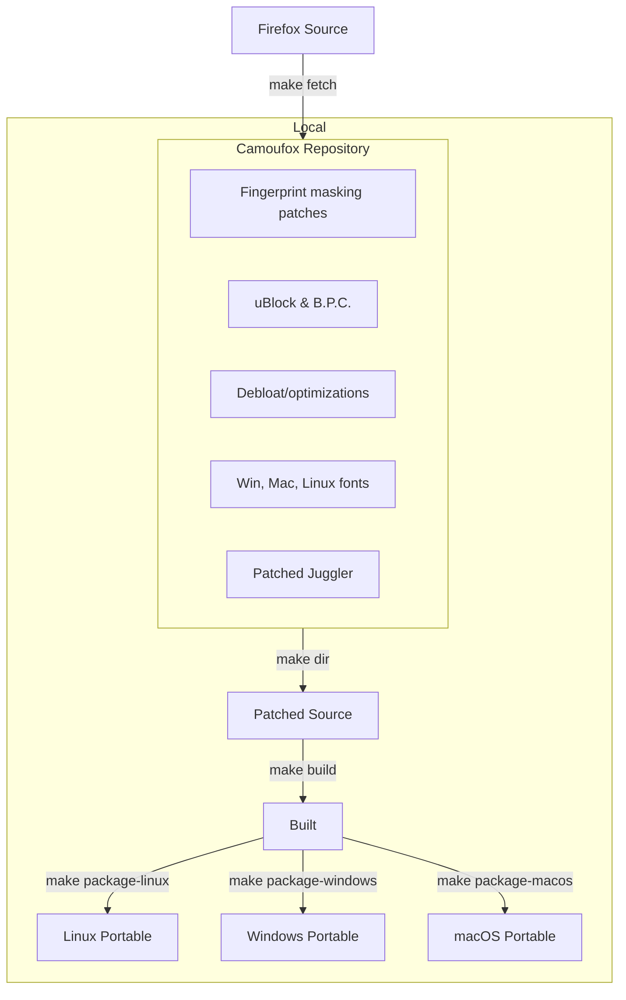
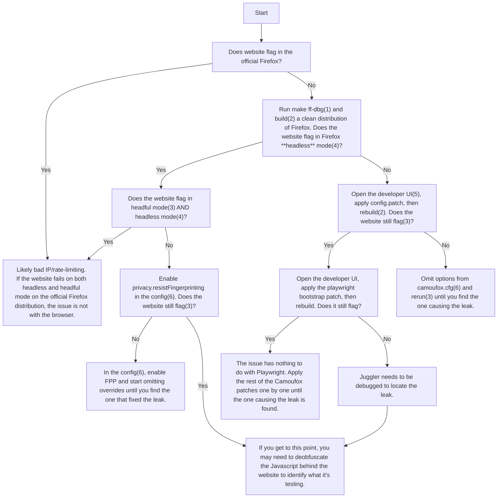

<h1 align="center">Camoufox</h1>

<h4 align="center">A stealthy, minimalistic, custom build of Firefox for web scraping 🦊</h4>

<p align="center">                                      
Camoufox is an open source anti-detect browser for robust fingerprint injection & anti-bot evasion.
</p>

<p align="center">
  <a href="https://trendshift.io/repositories/12224" target="_blank">
  </a>
</p>

---

> [!NOTE]
> All of the latest documentation is avaliable at [camoufox.com](https://camoufox.com).

## <span style="color:yellow">Firefox Version Upgrade Notice</span>

The current main branch is built for Firefox v146. It is an experimental change and may contain several bugs. If you are building from source and require a stable production version, use branch `releases/135`.

FF146 only works for MacOS. Linux support is coming in the next week and windows support by the end of January.

See the [Beta Testing Guide](docs/beta-testing-ff146.md) for instructions on testing FF146.

---

# Sponsors

<a href="https://scrapfly.io/?utm_source=github&utm_medium=sponsoring&utm_campaign=camoufox" target="_blank">

</a>

[Scrapfly](https://scrapfly.io/?utm_source=github&utm_medium=sponsoring&utm_campaign=camoufox) is an enterprise-grade solution providing Web Scraping API that aims to simplify the scraping process by managing everything: real browser rendering, rotating proxies, and fingerprints (TLS, HTTP, browser) to bypass all major anti-bots. Scrapfly also unlocks the observability by providing an analytical dashboard and measuring the success rate/block rate in detail.

---

<a href="https://cloverlabs.ai/?utm_source=github&utm_medium=sponsoring&utm_campaign=camoufox" target="_blank">

</a>

[Clover Labs](https://cloverlabs.ai/?utm_source=github&utm_medium=sponsoring&utm_campaign=camoufox) is a Toronto based venture studio building AI agents for growth and distribution.

---

<a href="https://www.thordata.com/?ls=github&lk=camoufox" target="_blank">
  
</a>

[Thordata](https://www.thordata.com/?ls=github&lk=camoufox) - Your First Plan is on Us! 💰 Get 100% of your first residential proxy purchase back as wallet balance, up to $900.

#### **⚡ Why Thordata?**

🌍 190+ real residential & ISP IP locations\
🔐 Fully encrypted, ultra-secure connections\
🚀 Optimized for web scraping, ad verification & automation workflows

🔥 Don't wait - this is your **best time to start** with [Thordata](https://www.thordata.com/?ls=github&lk=camoufox) and experience the safest, fastest proxy network.

---

# Introduction

Camoufox is a modern & effective open source solution for avoiding bot detection and intelligent fingerprint rotation.

## Highlights

- **Invisible to anti-bot systems** 🎭
  - Page agent is hidden from JavaScript inspection. See the [stealth page](https://camoufox.com/stealth) for more details.

* **Fingerprint injection & rotation (without JS injection!)**
  - All navigator properties (device, OS, hardware, browser, etc.) ✅
  - Screen size, resolution, window, & viewport properties ✅
  - Geolocation, timezone, locale, & Intl spoofing ✅
  - WebRTC IP spoofing at the protocol level ✅
  - Voices, speech playback rate, etc. ✅
  - And much, much more!

- **Anti Graphical fingerprinting**
  - WebGL parameters, supported extensions, context attributes, & shader precision formats ✅
  - Font spoofing & anti-fingerprinting ✅

* **Quality of life features**
  - Human-like mouse movement 🖱️
  - Blocks & circumvents ads 🛡️
  - No CSS animations 💨

- Debloated & optimized for memory efficiency ⚡
- [PyPi package](https://pypi.org/project/camoufox/) for updates & auto fingerprint injection 📦
- Stays up to date with the latest Firefox version 🕓

---

## Fingerprint Injection

In Camoufox, data is intercepted at the C++ implementation level, making the changes undetectable through JavaScript inspection.

To spoof individual fingerprint properties, pass a JSON containing properties to spoof to the [Python interface](https://github.com/daijro/camoufox/tree/main/pythonlib#camoufox-python-interface):

```py
>>> with Camoufox(config={"property": "value"}) as browser:
```

Config data not set by the user will be automatically populated using [BrowserForge](https://github.com/daijro/browserforge) fingerprints, which mimic the statistical distribution of device characteristics in real-world traffic.

[[See implemented properties](https://camoufox.com/fingerprint/)]

---

## Python Usage

Camoufox is compatible with your existing Playwright code. You only have to change your browser initialization.

**Sync API**

```python
from camoufox.sync_api import Camoufox

with Camoufox() as browser:
    page = browser.new_page()
    page.goto("https://example.com")
```

**Async API**

```python
from camoufox.async_api import AsyncCamoufox

async with AsyncCamoufox() as browser:
    page = await browser.new_page()
    await page.goto("https://example.com")
```

[[Installation & usage](https://camoufox.com/python/)]

---

## Capabilities

Below is a list of patches and features implemented in Camoufox.

### Fingerprint spoofing

- Navigator properties spoofing (device, browser, locale, etc.)
- Support for emulating screen size, resolution, etc.
- Spoof WebGL parameters, supported extensions, context attributes, and shader precision formats.
- Spoof inner and outer window viewport sizes
- Spoof AudioContext sample rate, output latency, and max channel count
- Spoof device voices & playback rates
- Spoof the amount of microphones, webcams, and speakers available.
- Network headers (Accept-Languages and User-Agent) are spoofed to match the navigator properties
- WebRTC IP spoofing at the protocol level
- Geolocation, timezone, and locale spoofing
- Battery API spoofing
- etc.

### Stealth patches

- Avoids main world execution leaks. All page agent javascript is sandboxed
- Avoids frame execution context leaks
- Fixes `navigator.webdriver` detection
- Fixes Firefox headless detection via pointer type ([#26](https://github.com/daijro/camoufox/issues/26))
- Removed potentially leaking anti-zoom/meta viewport handling patches
- Uses non-default screen & window sizes
- Re-enable fission content isolations
- Re-enable PDF.js
- Other leaking config properties changed
- Human-like cursor movement

### Anti font fingerprinting

- Automatically uses the correct system fonts for your User Agent
- Bundled with Windows, Mac, and Linux system fonts
- Prevents font metrics fingerprinting by randomly offsetting letter spacing

### Playwright support

- Custom implementation of Playwright for the latest Firefox
- Various config patches to evade bot detection

### Debloat/Optimizations

- Stripped out/disabled _many, many_ Mozilla services. Runs faster than the original Mozilla Firefox, and uses less memory (200mb)
- Patches from LibreWolf & Ghostery to help remove telemetry & bloat
- Debloat config from PeskyFox, LibreWolf, and others
- Speed & network optimizations from FastFox
- Removed all CSS animations
- Minimalistic theming
- etc.

### Addons

- Load Firefox addons without a debug server by passing a list of paths to the `addons` property
- Added uBlock Origin with custom privacy filters
- Addons are not allowed to open tabs
- Addons are automatically enabled in Private Browsing mode
- Addons are automatically pinned to the toolbar
- Fixes DNS leaks with uBO prefetching

### Python Interface

- Automatically generates & injects unique device characteristics into Camoufox based on their real-world distribution
- WebGL fingerprint injection & rotation
- Uses the correct system fonts and subpixel antialiasing & hinting based on your target OS
- Avoid proxy detection by calculating your target geolocation, timezone, & locale from your proxy's target region
- Calculate and spoof the browser's language based on the distribution of language speakers in the proxy's target region
- Remote server hosting to use Camoufox with other languages that support Playwright
- Built-in virtual display buffer to run Camoufox headfully on a headless server
- Toggle image loading, WebRTC, and WebGL
- etc.

> [!NOTE]
> Camoufox does **not** fully support injecting Chromium fingerprints. Some WAFs (such as [Interstitial](https://nopecha.com/demo/cloudflare)) test for Spidermonkey engine behavior, which is impossible to spoof.

---

# Stealth Overview

## How Camoufox hides its automation library

> [!WARNING]
> **Current status as of 2026**:
> There has been a year gap in maintenance due to a personal situation. Camoufox has gone down in performance due to the base Firefox version and newly discovered fingerprint inconsistencies. **Camoufox is currently under active development.**

In Camoufox, all of Playwright's internal Page Agent's code is sandboxed and isolated. This makes it impossible for a page to detect the presence of Playwright through Javascript inspection.

Normally, Playwright injects some JavaScript into the page such as `window.__playwright__binding__` and to perform actions like querying elements, evaluating javascript, or running init scripts, which can be detected by websites. In Camoufox, these actions are handled in an isolated scope outside of the page. In other words, websites can no longer "see" any JavaScript that Playwright would typically inject. This prevents traces of Playwright altogether.

However, even with hiding its automation library, Camoufox is not immune to inconsistencies in fingerprint rotation. This still requires maintenance to spot and fix.

### Page Interactions

Anti-bot systems also run client-side scripts to monitor your behavior. For example, they look for patterns in mouse movements, clicks, scrolling, and the timing between actions.

<video src="https://github.com/user-attachments/assets/6d33d6af-3537-4603-bf24-6bd3f4f8f455" width="200px" autoplay loop muted></video>

Camoufox tries its best with its human-like mouse movement algorithm. The natural motion algorithm was originally from [riflosnake's HumanCursor](https://github.com/riflosnake/HumanCursor) and has been rewritten in C++ and modified for more distance-aware trajectories.

However, this isn't perfect. It may still be detected with sophisticated enough analysis. (WIP for the future)

---

## How Camoufox rotates identities

In addition to hiding the automation library, your identity must be randomized in each instance as well to avoid rate limiting and detection. Rotating your IP address means nothing if it's obviously you each time. There are thousands of things that create a unique **fingerprint** of you. Right now, any website you visit can see you are using Chrome on Linux, running on NVIDIA GeForce RTX 4090.

### Market Share Distribution

Even if you are rotating your IP for each running bot instance, web access firewalls can still use machine learning to analyze incoming web traffic to detect if it's abnormal. If the Linux market share was 5%, then suddenly it's 20%, it's a red flag. They will unconditionally require all Linux users to complete a captcha.

Camoufox uses [BrowserForge](https://github.com/daijro/browserforge)'s fingerprint generator to mimic the statistical distribution of device data in real-world traffic. For example, Camoufox will make your browser look like a Linux user 5% of the time. Of that 5%, it will spoof a 2560x1440 screen resolution 9.5% of the time and an Intel HD GPU 27.5% of the time.

### How can Camoufox be detected?

Camoufox can spoof fingerprints with a correct market share. However, **fingerprints must also be internally consistent.** A Windows user agent with an Apple M1 GPU, a MacOS user agent with a Windows DirectX renderer, and a mobile device with a desktop screen resolution are all impossible, and will be flagged for being suspicious.

Of the thousands of possible datapoints that must be changed to create a believable spoofed fingerprint, where each change must be consistent with the others, Camoufox doesn't always succeed. Anti-bot providers test Camoufox over and over again to find even 1 unique inconsistency, then they immediately update their background scripts to test for it.

---

## How does Camoufox compare to other solutions?

### JavaScript-based solutions

In the past, developers tried injecting JavaScript to spoof these values, but it doesn't work reliably since JavaScript can't spoof everything. Incomplete coverage causes inconsistent fingerprints. For example, an anti-bot system will flag you if your network request's User Agent doesn't match your navigator's User Agent.

Additionally, all injected JavaScript is detectable in some way. Anti-bot systems can check if `Object.getOwnPropertyDescriptor` reveals an overwritten property, if a function's `toString()` no longer returns `[native code]` (revealing it was hijacked), or if data in the window context doesn't match the worker thread context. Workarounds only take you so far, but there will always be a way to detect JS injection if you search deep enough.

#### Camoufox's approach

Since Camoufox intercepts calls in the browser's C++ implementation level, all of the hijacked objects and properties appear native. There is no JavaScript hijacking to be detected.

Camoufox also attempts to generate consistent and believable fingerprints with Browserforge as well. However, this can still be detected by complex fingerprint detection methods like mismatching data (as described earlier).

<hr width=50>

### CDP-based libraries

CDP (Chrome DevTools Protocol) is an automation protocol built into Chromium and Firefox. However, CDP makes no effort to hide the fact that it's an automation protocol and exposes much of its functionality in the page scope. Some common methods are checking if `navigator.webdriver` is true, catching it reading the stack debugger, checking for variables that ChromeDriver injects into the document object for internal communication, and more.

#### Camoufox's approach

While Playwright uses CDP to control Chromium, it uses _Juggler_ for Firefox. Juggler is a custom protocol developed before Firefox supported CDP ([original repo](https://github.com/puppeteer/juggler)). It is a distinct module within Firefox, and not part of its core browser. This makes it easier to edit and control what's revealed to the page.

Camoufox patches Juggler to give it its own isolated "copy" of the page to work with. Playwright can read and edit its own version of the page freely. Everything appears to work normally to it, but the real page is completely unaffected by these changes. The page also can't detect when things are being read (through tricks like hijacking getters) or listeners being added to watch elements.

Additionally, Juggler sends its inputs directly through the Firefox's original user input handlers, meaning they are handled the exact same way as if you were using the browser normally. Camoufox also patches Firefox's headless mode to appear the same as if it were running in a normal window. But as a fallback, the Python library can run Camoufox in a [virtual display](https://camoufox.com/python/virtual-display/) if headless mode ever leaks.

---

<h1 align="center">Build System</h1>

> [!WARNING]
> The content below is intended for those interested in building & debugging Camoufox. For Playwright usage instructions, see [here](https://github.com/daijro/camoufox/tree/main/pythonlib#camoufox-python-interface).

### Overview

Here is a diagram of the build system, and its associated make commands:



This was originally based on the LibreWolf build system.

## Build CLI

> [!WARNING]
> Camoufox's build system is designed to be used in Linux. WSL will not work!

First, clone this repository with Git:

```bash
git clone --depth 1 https://github.com/daijro/camoufox
cd camoufox
```

Next, build the Camoufox source code with the following command:

```bash
make dir
```

After that, you have to bootstrap your system to be able to build Camoufox. You only have to do this one time. It is done by running the following command:

```bash
make bootstrap
```

Finally you can build and package Camoufox the following command:

```bash
python3 multibuild.py --target linux windows macos --arch x86_64 arm64 i686
```

<details>
<summary>
CLI Parameters
</summary>

```bash
Options:
  -h, --help            show this help message and exit
  --target {linux,windows,macos} [{linux,windows,macos} ...]
                        Target platforms to build
  --arch {x86_64,arm64,i686} [{x86_64,arm64,i686} ...]
                        Target architectures to build for each platform
  --bootstrap           Bootstrap the build system
  --clean               Clean the build directory before starting

Example:
$ python3 multibuild.py --target linux windows macos --arch x86_64 arm64
```

</details>

### Using Docker

Camoufox can be built through Docker on all platforms.

1. Create the Docker image containing Firefox's source code:

```bash
docker build -t camoufox-builder .
```

2. Build Camoufox patches to a target platform and architecture:

```bash
docker run -v "$(pwd)/dist:/app/dist" camoufox-builder --target <os> --arch <arch>
```

<details>
<summary>
How can I use my local ~/.mozbuild directory?
</summary>

If you want to use the host's .mozbuild directory, you can use the following command instead to run the docker:

```bash
docker run \
  -v "$HOME/.mozbuild":/root/.mozbuild:rw,z \
  -v "$(pwd)/dist:/app/dist" \
  camoufox-builder \
  --target <os> \
  --arch <arch>
```

</details>

<details>
<summary>
Docker CLI Parameters
</summary>

```bash
Options:
  -h, --help            show this help message and exit
  --target {linux,windows,macos} [{linux,windows,macos} ...]
                        Target platforms to build
  --arch {x86_64,arm64,i686} [{x86_64,arm64,i686} ...]
                        Target architectures to build for each platform
  --bootstrap           Bootstrap the build system
  --clean               Clean the build directory before starting

Example:
$ docker run -v "$(pwd)/dist:/app/dist" camoufox-builder --target windows macos linux --arch x86_64 arm64 i686
```

</details>

Build artifacts will now appear written under the `dist/` folder.

---

## Development Tools

This repo comes with a developer UI under scripts/developer.py:

```
make edits
```

Patches can be edited, created, removed, and managed through here.


### How to make a patch

1. In the developer UI, click **Reset workspace**.
2. Make changes in the `camoufox-*/` folder as needed. You can test your changes with `make build` and `make run`.
3. After you're done making changes, click **Write workspace to patch** and save the patch file.

### How to work on an existing patch

1. In the developer UI, click **Edit a patch**.
2. Select the patch you'd like to edit. Your workspace will be reset to the state of the selected patch.
3. After you're done making changes, hit **Write workspace to patch** and overwrite the existing patch file.

---

## Leak Debugging

This is a flow chart demonstrating my process for determining leaks without deobfuscating WAF Javascript. The method incrementally reintroduces Camoufox's features into Firefox's source code until the testing site flags.

This process requires a Linux system and assumes you have Firefox build tools installed (see [here](https://github.com/daijro/camoufox?tab=readme-ov-file#build-cli)).

<details>
<summary>
See flow chart...
</summary>



#### Cited Commands

| #   | Command                                       | Description                                                                                                 |
| --- | --------------------------------------------- | ----------------------------------------------------------------------------------------------------------- |
| (1) | `make ff-dbg`                                 | Setup vanilla Firefox with minimal patches.                                                                 |
| (2) | `make build`                                  | Build the source code.                                                                                      |
| (3) | `make run`                                    | Runs the built browser.                                                                                     |
| (4) | `make run args="--headless https://test.com"` | Run a URL in headless mode. All redirects will be printed to the console to determine if the test passed.   |
| (5) | `make edits`                                  | Opens the developer UI. Allows the user to apply/undo patches, and see which patches are currently applied. |
| (6) | `make edit-cfg`                               | Edit camoufox.cfg in the default system editor.                                                             |

</details>

---

## Thanks

Debloating & references:

- [LibreWolf](https://gitlab.com/librewolf-community/browser/source): Debloat patches & build system inspiration
- [BetterFox](https://github.com/yokoffing/BetterFox): Speed and debloat preferences
- [Ghostery](https://github.com/ghostery/user-agent-desktop): Debloat reference ([disable onboarding](https://github.com/daijro/camoufox/blob/main/patches/ghostery/Disable-Onboarding-Messages.patch))

Web scraping & testing:

- [riflosnake/HumanCursor](https://github.com/riflosnake/HumanCursor): Original human-like cursor movement algorithm, ported to C++
- [CreepJS](https://github.com/abrahamjuliot/creepjs), [Browserleaks](https://browserleaks.com), [BrowserScan](https://www.browserscan.net/) - Valuable leak testing sites

UI theming:

- [Jamir-boop/minimalisticfox](https://github.com/Jamir-boop/minimalisticfox): Inspired Camoufox's minimal css theming [(link)](https://github.com/daijro/camoufox/blob/main/settings/chrome.css)
