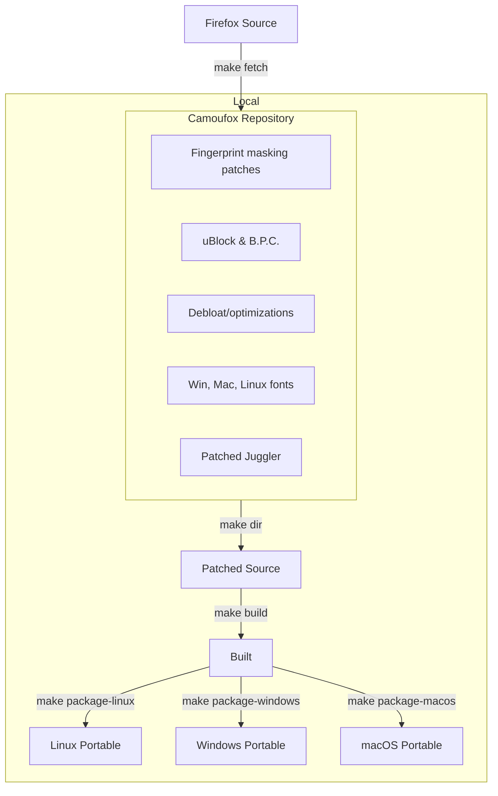
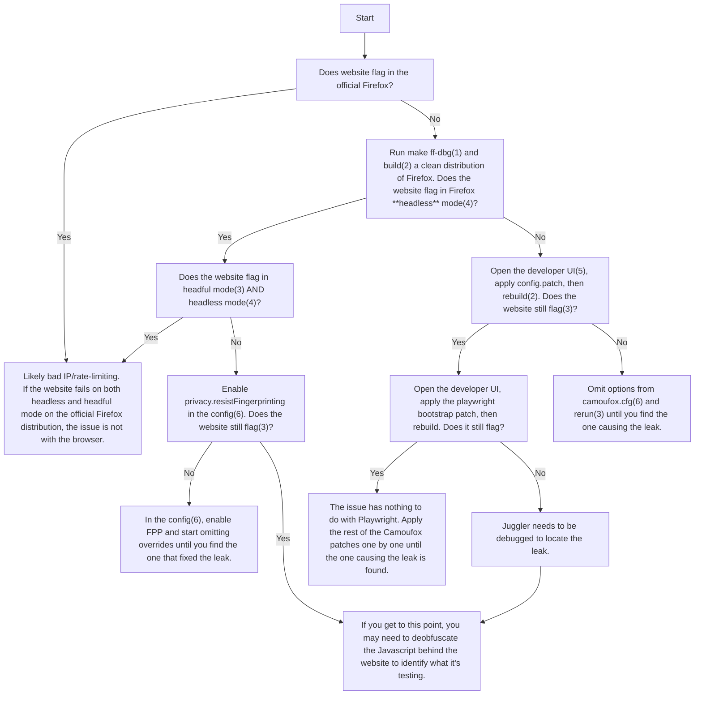

<h1 align="center">Camoufox</h1>

<h4 align="center">Camoufox is an open source anti-detect browser built for webscraping & AI agents. 🦊</h4>

<div align="center">
  <a href="https://trendshift.io/repositories/12224" target="_blank">
    
  </a><br>
  <a href="https://pepy.tech/projects/camoufox">
  <a href="https://pepy.tech/projects/camoufox"></a>
    <a href="https://pepy.tech/projects/camoufox"></a>
<h4>⚠️ This project is under development. It may not be suitable for stable production use. ⚠️</h4>
</div>

---

> [!NOTE]
> **All of the latest documentation is available at [camoufox.com](https://camoufox.com).**

> [!NOTE]
> Browser development is active at [github.com/CloverLabsAI/camoufox](https://github.com/CloverLabsAI/camoufox) and [github.com/VulpineOS/VulpineOS](https://github.com/VulpineOS/VulpineOS).<br>This repo is being used to merge checkpoint releases and should be treated as the master copy.

---

# Sponsors

<details open>
<summary>View/Collapse All</summary>
<br>
<table>
  <tr>
    <td width="25%" align="center" valign="middle">
      <a href="https://scrapfly.io/?utm_source=github&utm_medium=sponsoring&utm_campaign=camoufox" target="_blank">
        
      </a>
    </td>
    <td valign="middle">
      <a href="https://scrapfly.io/?utm_source=github&utm_medium=sponsoring&utm_campaign=camoufox">Scrapfly</a> is an enterprise-grade solution providing Web Scraping API that aims to simplify the scraping process by managing everything: real browser rendering, rotating proxies, and fingerprints (TLS, HTTP, browser) to bypass all major anti-bots. Scrapfly also unlocks the observability by providing an analytical dashboard and measuring the success rate/block rate in detail.
    </td>
  </tr>
  <tr>
    <td width="25%" align="center" valign="middle">
      <a href="https://cloverlabs.ai/?utm_source=github&utm_medium=sponsoring&utm_campaign=camoufox" target="_blank">
        
      </a>
    </td>
    <td valign="middle">
      <a href="https://cloverlabs.ai/?utm_source=github&utm_medium=sponsoring&utm_campaign=camoufox">Clover Labs</a> is a Toronto based venture studio building AI agents for growth and distribution.
    </td>
  </tr>
  <tr>
    <td width="25%" align="center" valign="middle" height="100">
      <a href="https://serpapi.com/use-cases/web-search-api?utm_source=camoufox" target="_blank">
        
      </a>
    </td>
    <td valign="middle">
      <a href="https://serpapi.com/use-cases/web-search-api?utm_source=camoufox">SerpApi, a web search API</a> to scrape Google and other search engines with a simple API.
    </td>
  </tr>
  <tr>
    <td width="25%" align="center" valign="middle" height="100">
      <a href="https://talordata.com/?campaignid=X01VSF4OOvlHfN6U&utm_source=github&utm_term=camoufox" target="_blank">
        
      </a>
    </td>
    <td valign="middle">
      <a href="https://talordata.com/?campaignid=X01VSF4OOvlHfN6U&utm_source=github&utm_term=camoufox">Talordata</a> is a simple web search API to scrape Google and other search engines at a fraction of the cost. Get 1,000 free requests upon registration, and pay just $0.25 per 1,000 successful responses—zero charges for failed scrapes.<br>
Use coupon code <strong>CAMOUFOX</strong> for <strong>10% OFF</strong> Residential Proxies. [<a href="https://discord.gg/dMZFyY39Fx">Discord</a>]
    </td>
  </tr>
  <tr>
    <td width="25%" align="center" valign="middle" height="100">
      <a href="https://crawlbase.com/?utm_source=github&utm_medium=sponsorship&utm_campaign=camoufox" target="_blank">
        
      </a>
    </td>
    <td valign="middle">
      <strong>Web data that survives the anti-bots.</strong><br>
      <a href="https://crawlbase.com/?utm_source=github&utm_medium=sponsorship&utm_campaign=camoufox">Crawlbase</a> gives developers and AI teams reliable data at scale: a 99% success-rate Crawler, Crawling API, Smart AI Proxies, and Web MCP Server that get through, so your scrapers and agents don't break. You build, we handle the infrastructure.

<strong>Get 15% off your first 3 months with code CAMOUFOX</strong> → <a href="https://crawlbase.com/?utm_source=github&utm_medium=sponsorship&utm_campaign=camoufox">crawlbase.com</a>
    </td>
  </tr>
  <tr>
    <td width="25%" align="center" valign="middle">
      <a href="https://scrappey.com/?utm_source=camoufox&utm_medium=sponsorship&utm_campaign=camoufox_sponsorship" target="_blank">
        
      </a>
    </td>
    <td valign="middle">
      <a href="https://scrappey.com/?utm_source=camoufox&utm_medium=sponsorship&utm_campaign=camoufox_sponsorship">Scrappey</a> is a Web Scraping API that only charges successful scrapes with pay as you go - no subscriptions. Scrape complex sites. Residential proxies included, no hidden proxy fees, or expiring balances. One API for direct HTTP, full-browser rendering, JavaScript-heavy pages, screenshots, sessions, 30+ browser actions and 200+ concurrent sessions at a time - trusted by 1000+ developers and AI agents. Get 10% off with code CAMOUFOX.
    </td>
  </tr>
</table>

## Proxy providers

Camoufox is intended to be used with rotating proxies (preferably residential IPs). Check out these providers:

<table>
  <tr>
    <td width="25%" align="center" valign="middle">
      <a href="https://proxyempire.io/?ref=camoufox&utm_source=camoufox" target="_blank">
        
      </a>
    </td>
    <td valign="middle">
      <b>🚀 Camoufox × ProxyEmpire</b><br>
      Running Camoufox? Your proxy layer decides whether you scale — or get blocked.<br>
      <a href="https://proxyempire.io/?ref=camoufox&utm_source=camoufox">ProxyEmpire</a> delivers:<br>
      • 🌍 30M+ Residential IPs (170+ countries)<br>
      • 📱 4G/5G Mobile Proxies<br>
      • 🔄 Rotating & Sticky Sessions<br>
      • ⚡ Unlimited Concurrent Sessions<br>
      • 🎯 Precise geo-targeting<br>
      • HTTP, HTTPS & SOCKS5 Support<br>
      Built for scraping, automation, and high-stealth workflows.<br>
      <b>🔥 Exclusive Offer</b> - Use code <b>Camoufox30</b><br>
      Get <b>30% recurring discount</b> (not just first month). Upgrade your proxies. Reduce bans. Scale properly
    </td>
  </tr>
  <tr>
    <td width="25%" align="center" valign="middle">
      <a href="https://birdproxies.com/t/camoufox" target="_blank">
        
      </a>
    </td>
    <td valign="middle">
      Hey, we built BirdProxies because proxies shouldn't be complicated or overpriced. Fast residential and ISP proxies in 195+ locations, fair pricing, and real support.<br>
      Try our FlappyBird game on the landing page for free data!<br>
      <a href="https://birdproxies.com/t/camoufox">Try Now</a> | <a href="https://discord.com/invite/birdproxies">Discord</a>
    </td>
  </tr>
  <tr>
    <td width="25%" align="center" valign="middle">
      <a href="https://www.rapidproxy.io/?ref=daijro" target="_blank">
        
      </a>
    </td>
    <td valign="middle">
      <a href="https://www.rapidproxy.io/?ref=daijro">RapidProxy</a> - Power Your Data with Premium Proxies.<br>
      🎁 Try proxies for free  + Use code <strong>RAPID10</strong> for <strong>10% OFF</strong>
      <br>
      <strong>Why Choose RapidProxy?</strong><br>
      • 🌍 90M+ IPs in 200+ countries & regions<br>
      • ♾️ No expiration on traffic — use anytime, no pressure<br>
      • 🔥 Unlimited concurrency for maximum performance<br>
      • 💰 Starting from just $0.65/GB — built for scale<br>
      • 📍 City-level targeting for precise geo access<br>
      • 🔄 Flexible session control tailored to your needs<br>
      Don’t miss out — start your free trial today and experience fast, stable, and scalable proxy performance with <a href="https://www.rapidproxy.io/?ref=daijro">RapidProxy</a>.
    </td>
  </tr>
  <tr>
    <td width="25%" align="center" valign="middle">
      <a href="https://www.swiftproxy.net/?ref=daijro" target="_blank">
        
      </a>
    </td>
    <td valign="middle">
      <a href="https://www.swiftproxy.net/?ref=daijro">Swiftproxy</a> - <strong>High-Performance Residential Proxies for Scalable Data Collection</strong><br>
      Built for developers who need <strong>reliable</strong>, anti-detection proxy infrastructure. Swiftproxy delivers stable connections, high success rates, and flexible control for large-scale scraping and automation.<br>
      • 🌍 195+ locations with ethically sourced residential IPs<br>
      • 🔄 <strong>Rotating</strong> & <strong>sticky</strong> sessions with precise geo-targeting<br>
      • ⚡ Optimized for <strong>anti-ban</strong> & <strong>high success rate</strong><br>
      • 🔌 HTTP / HTTPS / SOCKS5 support<br>
      • 🧪 <strong>Free 500MB trial</strong> for testing<br>
      • 💸 <strong>Special discount</strong> code for Camoufox users: <strong>PROXY90 - 10%</strong><br>
      Best for: Web scraping, automation, multi-accounting, and large-scale data extraction
    </td>
  </tr>     
  <tr>
    <td width="25%" align="center" valign="middle">
      <a href="https://mangoproxy.com/?utm_source=github&utm_medium=partner&utm_campaign=daijro" target="_blank">
        
      </a>
    </td>
    <td valign="middle">
      <a href="https://mangoproxy.com/?utm_source=github&utm_medium=partner&utm_campaign=daijro">MangoProxy</a> is a Residential, ISP, Mobile and Datacenter proxy service designed for professional tasks where stability, speed, and anonymity matter.<br>
      Use code DAIJRO for 8% OFF ISP Static Proxies
    </td>
  </tr>
  <tr>
    <td width="25%" align="center" valign="middle">
      <a href="https://9proxy.com/pricing?utm_source=github&utm_medium=daijro&utm_campaign=githubdev&utm_content=sponsored" target="_blank">
        
      </a>
    </td>
    <td valign="middle">
      <a href="https://9proxy.com/pricing?utm_source=github&utm_medium=daijro&utm_campaign=githubdev&utm_content=sponsored">9Proxy</a> provides residential proxies from just $0.018/IP or $0.68/GB. 20M+ IPs across 90+ countries. Sticky or rotating sessions, managed from desktop or mobile app.<br>
    </td>
  </tr>
  <tr>
    <td width="25%" align="center" valign="middle">
      <a href="https://go.nodemaven.com/daijronew" target="_blank">
        
      </a>
    </td>
    <td valign="middle">
      <a href="https://go.nodemaven.com/daijronew">NodeMaven</a>: The most reliable proxy provider with the Highest Quality IP on the market.<br>
      Best solution for automation, web scraping, SEO research, and social media management.<br>
      <a href="https://go.nodemaven.com/daijronew">NodeMaven</a> offers:<br>
      • Sticky sessions up to 7 days<br>
      • 99.9% uptime<br>
      • IP filtering: all proxies have fraud score <97%<br>
      • No KYC required<br>
      • Cashback on traffic - burn GB and earn up to 10% back<br>
Special offer: Use code CAMOUFOX35 to get 35% discount on Proxies.
    </td>
  </tr>
  <tr>
    <td width="25%" align="center" valign="middle">
      <a href="https://proxidize.com/?utm_source=github&utm_medium=sponsorship&utm_campaign=camoufox&utm_content=daijro" target="_blank">
        
      </a>
    </td>
    <td valign="middle">
      <strong><a href="https://proxidize.com/?utm_source=github&utm_medium=sponsorship&utm_campaign=camoufox&utm_content=daijro">Proxidize</a> | Mobile and Residential Proxies for Camoufox</strong><br>
      Running Camoufox at scale? Your browser setup is only half the stack. Your proxy layer matters too.<br>
      Proxidize provides mobile and residential proxies built for scraping, browser automation, SEO monitoring, AI agents, and data collection workflows.<br>
      <strong>Why Proxidize?</strong><br>
      • Real 4G and 5G mobile proxies<br>
      • Residential proxies in 195+ countries<br>
      • Rotating and sticky sessions<br>
      • City-level and carrier targeting<br>
      • Unlimited concurrency<br>
      • HTTP(S), SOCKS5, and UDP over SOCKS support<br>
      • No hardware or DIY setup required<br>
      Built for teams that need reliable proxy infrastructure without managing devices, servers, or proxy rotation themselves.<br>
      <strong>Special offer for Camoufox users</strong>: Use code <strong>CAMOUFOX20</strong> for <strong>20% off</strong>.<br>
      Start now: <a href="https://proxidize.com/?utm_source=github&utm_medium=sponsorship&utm_campaign=camoufox&utm_content=daijro">https://proxidize.com</a>
    </td>
  </tr>
</table>
</details>

---

# Introduction

Camoufox is a Firefox fork engineered for web scraping and AI agents. It is headless, undetectable, and optimized to run at scale. Every run gets a fresh identity drawn from the real-world distribution of devices, so it blends into normal traffic instead of standing out.

## Highlights

* **Built for AI agents** 🤖
  * Minimal, debloated Firefox - fast to launch, cheap to run
  * Drop-in Playwright compatibility via Python interface
  * Invisible to anti-bot systems so you can run your agent cluster locally or in the cloud without being flagged

- **Undetectable by design** 🎭
  - Page automation hidden from JavaScript inspection. See the [stealth page](https://camoufox.com/stealth) for more details.

* **Fingerprint injection & rotation (without JS injection!)**
  * All navigator properties (device, OS, hardware, browser, etc.) ✅
  * Screen size, resolution, window, & viewport properties ✅
  * Geolocation, timezone, locale, & Intl spoofing ✅
  * WebRTC IP spoofing at the protocol level ✅
  * Voices, speech playback rate, etc. ✅
  * And much, much more!

- **Anti Graphical fingerprinting**
  - WebGL parameters, supported extensions, context attributes, & shader precision formats ✅
  - Font spoofing & anti-fingerprinting ✅

* **Optimized for automation**
  * Human-like mouse movement 🖱️
  * Blocks & circumvents ads 🛡️
  * No CSS animations 💨

- Debloated & optimized for memory efficiency ⚡
- [PyPi package](https://pypi.org/project/camoufox/) for updates & auto fingerprint injection 📦
- Stays up to date with the latest Firefox version 🕓

---

## Fingerprint Injection

In Camoufox, data is intercepted at the C++ implementation level, making the changes undetectable through JavaScript inspection.

To spoof individual fingerprint properties, pass a JSON containing properties to spoof to the [Python interface](https://github.com/daijro/camoufox/tree/main/pythonlib#camoufox-python-interface):

```py
>>> with Camoufox(config={"property": "value"}) as browser:
```

Config data not set by the user will be automatically populated using [BrowserForge](https://github.com/daijro/browserforge) fingerprints, which mimic the statistical distribution of device characteristics in real-world traffic.

[[See implemented properties](https://camoufox.com/fingerprint/)]

---

## Python Usage

Camoufox is compatible with your existing Playwright code. You only have to change your browser initialization.

**Sync API**

```python
from camoufox.sync_api import Camoufox

with Camoufox() as browser:
    page = browser.new_page()
    page.goto("https://example.com")
```

**Async API**

```python
from camoufox.async_api import AsyncCamoufox

async with AsyncCamoufox() as browser:
    page = await browser.new_page()
    await page.goto("https://example.com")
```

[[Installation & usage](https://camoufox.com/python/)]

### Making Full use of Hardware Spoofing

For stable releases, you should always use the main [`camoufox`](https://pypi.org/project/camoufox/) pip package. However, if you want to make use of per-context fingerprints and hardware spoofing, use the [`cloverlabs-camoufox`](https://pypi.org/project/cloverlabs-camoufox/) package. This package is updated with each releases, whereas the official package is released on delay.

Make sure you are using a virtual env to avoid conflicts between the two packages.

**Installation**

```bash
pip install cloverlabs-camoufox
```

**Fetch the latest prerelease browser** (recommended for newest patches)

```bash
python -m camoufox sync
python -m camoufox set official/prerelease
python -m camoufox fetch
```

**Usage** — the API is identical to the upstream package:

```python
from camoufox.sync_api import Camoufox

with Camoufox() as browser:
    page = browser.new_page()
    page.goto("https://example.com")
```

#### Real fingerprint presets (recommended for v149+ binaries)

By default, fingerprint values are synthesized by BrowserForge. For better evasion against complex consistency checks, opt into the bundled presets — real fingerprints scraped from in-the-wild Firefox traffic:

```python
with Camoufox(fingerprint_preset=True, os="macos") as browser:
    ...
```

The library auto-routes by binary version: Firefox ≥ 149 loads `fingerprint-presets-v150.json` (312 presets covering v149–v152, 67 macOS / 180 Windows / 65 Linux); older binaries fall back to the original bundle. UA strings are rewritten to match the active binary, so opting in is safe across versions. Pass a preset dict instead of `True` to pin a specific fingerprint.

---

## Capabilities

Below is a list of patches and features implemented in Camoufox.

### Fingerprint spoofing

- Navigator properties spoofing (device, browser, locale, etc.)
- Support for emulating screen size, resolution, etc.
- Spoof WebGL parameters, supported extensions, context attributes, and shader precision formats.
- Spoof inner and outer window viewport sizes
- Spoof AudioContext sample rate, output latency, and max channel count
- Spoof device voices & playback rates
- Spoof the amount of microphones, webcams, and speakers available.
- Network headers (Accept-Languages and User-Agent) are spoofed to match the navigator properties
- WebRTC IP spoofing at the protocol level
- Geolocation, timezone, and locale spoofing
- Battery API spoofing
- etc.

### Stealth patches

- Avoids main world execution leaks. All page agent javascript is sandboxed
- Avoids frame execution context leaks
- Fixes `navigator.webdriver` detection
- Fixes Firefox headless detection via pointer type ([#26](https://github.com/daijro/camoufox/issues/26))
- Removed potentially leaking anti-zoom/meta viewport handling patches
- Uses non-default screen & window sizes
- Re-enable fission content isolations
- Re-enable PDF.js
- Other leaking config properties changed
- Human-like cursor movement

### Anti font fingerprinting

- Automatically uses the correct system fonts for your User Agent
- Bundled with Windows, Mac, and Linux system fonts
- Prevents font metrics fingerprinting by randomly offsetting letter spacing

### Playwright support

- Custom implementation of Playwright for the latest Firefox
- Various config patches to evade bot detection

### Debloat/Optimizations

- Stripped out/disabled _many, many_ Mozilla services. Runs faster than the original Mozilla Firefox, and uses less memory (200mb)
- Patches from LibreWolf & Ghostery to help remove telemetry & bloat
- Debloat config from PeskyFox, LibreWolf, and others
- Speed & network optimizations from FastFox
- Removed all CSS animations
- Minimalistic theming
- etc.

### Addons

- Load Firefox addons without a debug server by passing a list of paths to the `addons` property
- Added uBlock Origin with custom privacy filters
- Addons are not allowed to open tabs
- Addons are automatically enabled in Private Browsing mode
- Addons are automatically pinned to the toolbar
- Fixes DNS leaks with uBO prefetching

### Python Interface

- Automatically generates & injects unique device characteristics into Camoufox based on their real-world distribution
- WebGL fingerprint injection & rotation
- Uses the correct system fonts and subpixel antialiasing & hinting based on your target OS
- Avoid proxy detection by calculating your target geolocation, timezone, & locale from your proxy's target region
- Calculate and spoof the browser's language based on the distribution of language speakers in the proxy's target region
- Remote server hosting to use Camoufox with other languages that support Playwright
- Built-in virtual display buffer to run Camoufox headfully on a headless server
- Toggle image loading, WebRTC, and WebGL
- etc.

> [!NOTE]
> Camoufox does **not** fully support injecting Chromium fingerprints. Some WAFs (such as [Interstitial](https://nopecha.com/demo/cloudflare)) test for Spidermonkey engine behavior, which is impossible to spoof.

---

# Stealth Overview

## How Camoufox hides its automation library

> [!WARNING]
> **Current status as of 2026**:
> There has been a year gap in maintenance due to a personal situation. Camoufox has gone down in performance due to the base Firefox version and newly discovered fingerprint inconsistencies. **Camoufox is currently under active development.**

In Camoufox, all of Playwright's internal Page Agent's code is sandboxed and isolated. This makes it impossible for a page to detect the presence of Playwright through Javascript inspection.

Normally, Playwright injects some JavaScript into the page such as `window.__playwright__binding__` and to perform actions like querying elements, evaluating javascript, or running init scripts, which can be detected by websites. In Camoufox, these actions are handled in an isolated scope outside of the page. In other words, websites can no longer "see" any JavaScript that Playwright would typically inject. This prevents traces of Playwright altogether.

However, even with hiding its automation library, Camoufox is not immune to inconsistencies in fingerprint rotation. This still requires maintenance to spot and fix.

### Page Interactions

Anti-bot systems also run client-side scripts to monitor your behavior. For example, they look for patterns in mouse movements, clicks, scrolling, and the timing between actions.

<video src="https://github.com/user-attachments/assets/6d33d6af-3537-4603-bf24-6bd3f4f8f455" width="200px" autoplay loop muted></video>

Camoufox tries its best with its human-like mouse movement algorithm. The natural motion algorithm was originally from [riflosnake's HumanCursor](https://github.com/riflosnake/HumanCursor) and has been rewritten in C++ and modified for more distance-aware trajectories.

However, this isn't perfect. It may still be detected with sophisticated enough analysis. (WIP for the future)

---

## How Camoufox rotates identities

AI agents need to operate across many sessions without getting flagged or rate-limited. Rotating your IP address isn't enough — every browser session carries thousands of signals that create a unique **fingerprint**. A website can see your OS, GPU, screen resolution, fonts, timezone, and more. If those signals are inconsistent or unusual, you get blocked.

### Market Share Distribution

Even if you are rotating your IP for each running bot instance, web access firewalls can still use machine learning to analyze incoming web traffic to detect if it's abnormal. If the Linux market share was 5%, then suddenly it's 20%, it's a red flag. They will unconditionally require all Linux users to complete a captcha.

Camoufox uses [BrowserForge](https://github.com/daijro/browserforge)'s fingerprint generator to mimic the statistical distribution of device data in real-world traffic. For example, Camoufox will make your browser look like a Linux user 5% of the time. Of that 5%, it will spoof a 2560x1440 screen resolution 9.5% of the time and an Intel HD GPU 27.5% of the time.

### How can Camoufox be detected?

Camoufox can spoof fingerprints with a correct market share. However, **fingerprints must also be internally consistent.** A Windows user agent with an Apple M1 GPU, a MacOS user agent with a Windows DirectX renderer, and a mobile device with a desktop screen resolution are all impossible, and will be flagged for being suspicious.

Of the thousands of possible datapoints that must be changed to create a believable spoofed fingerprint, where each change must be consistent with the others, Camoufox doesn't always succeed. Anti-bot providers test Camoufox over and over again to find even 1 unique inconsistency, then they immediately update their background scripts to test for it.

---

## How does Camoufox compare to other solutions?

### JavaScript-based solutions

In the past, developers tried injecting JavaScript to spoof these values, but it doesn't work reliably since JavaScript can't spoof everything. Incomplete coverage causes inconsistent fingerprints. For example, an anti-bot system will flag you if your network request's User Agent doesn't match your navigator's User Agent.

Additionally, all injected JavaScript is detectable in some way. Anti-bot systems can check if `Object.getOwnPropertyDescriptor` reveals an overwritten property, if a function's `toString()` no longer returns `[native code]` (revealing it was hijacked), or if data in the window context doesn't match the worker thread context. Workarounds only take you so far, but there will always be a way to detect JS injection if you search deep enough.

#### Camoufox's approach

Since Camoufox intercepts calls in the browser's C++ implementation level, all of the hijacked objects and properties appear native. There is no JavaScript hijacking to be detected.

Camoufox also attempts to generate consistent and believable fingerprints with Browserforge as well. However, this can still be detected by complex fingerprint detection methods like mismatching data (as described earlier).

<hr width=50>

### CDP-based libraries

CDP (Chrome DevTools Protocol) is an automation protocol built into Chromium and Firefox. However, CDP makes no effort to hide the fact that it's an automation protocol and exposes much of its functionality in the page scope. Some common methods are checking if `navigator.webdriver` is true, catching it reading the stack debugger, checking for variables that ChromeDriver injects into the document object for internal communication, and more.

#### Camoufox's approach

While Playwright uses CDP to control Chromium, it uses _Juggler_ for Firefox. Juggler is a custom protocol developed before Firefox supported CDP ([original repo](https://github.com/puppeteer/juggler)). It is a distinct module within Firefox, and not part of its core browser. This makes it easier to edit and control what's revealed to the page.

Camoufox patches Juggler to give it its own isolated "copy" of the page to work with. Playwright can read and edit its own version of the page freely. Everything appears to work normally to it, but the real page is completely unaffected by these changes. The page also can't detect when things are being read (through tricks like hijacking getters) or listeners being added to watch elements.

Additionally, Juggler sends its inputs directly through the Firefox's original user input handlers, meaning they are handled the exact same way as if you were using the browser normally. Camoufox also patches Firefox's headless mode to appear the same as if it were running in a normal window. But as a fallback, the Python library can run Camoufox in a [virtual display](https://camoufox.com/python/virtual-display/) if headless mode ever leaks.

*(Another project patching Firefox at the source level, with a different driver-side focus - killing automation-layer tells like an attached debugger rather than isolating Juggler's page copy: [invisible_playwright](https://github.com/feder-cr/invisible_playwright).)*

---

<h1 align="center">Build System</h1>

> [!WARNING]
> The content below is intended for those interested in building & debugging Camoufox. For Playwright usage instructions, see [here](https://github.com/daijro/camoufox/tree/main/pythonlib#camoufox-python-interface).

### Overview

Here is a diagram of the build system, and its associated make commands:


```mermaid
graph TD
    FFSRC[Firefox Source] -->|make fetch| REPO

    subgraph REPO[Camoufox Repository]
        PATCHES[Fingerprint masking patches]
        ADDONS[uBlock & B.P.C.]
        DEBLOAT[Debloat/optimizations]
        SYSTEM_FONTS[Win, Mac, Linux fonts]
        JUGGLER[Patched Juggler]
    end

    subgraph Local
    REPO -->|make dir| PATCH[Patched Source]
    PATCH -->|make build| BUILD[Built]
    BUILD -->|make package-linux| LINUX[Linux Portable]
    BUILD -->|make package-windows| WIN[Windows Portable]
    BUILD -->|make package-macos| MAC[macOS Portable]
    end
```

This was originally based on the LibreWolf build system.

## Build CLI

> [!WARNING]
> Camoufox's build system is designed to be used in Linux. WSL will not work!

First, clone this repository with Git:

```bash
git clone --depth 1 https://github.com/daijro/camoufox
cd camoufox
```

Next, build the Camoufox source code with the following command:

```bash
make dir
```

Before bootstrapping, install the system build dependencies with the helper
script. It detects your platform and installs everything the build needs
(Python ≥ 3.11, Rust, `aria2`, `p7zip`, `go`, `msitools`, `wget`, `sqlite`, and
the core build tools) using the appropriate package manager — Homebrew on macOS,
or `apt`/`dnf`/`pacman` on Linux:

```bash
bash scripts/install-deps.sh
```

> [!NOTE]
> The dependency installer has so far only been tested on macOS.

After that, you have to bootstrap your system to be able to build Camoufox. You only have to do this one time. It is done by running the following command:

```bash
make bootstrap
```

Finally you can build and package Camoufox the following command:

```bash
python3 multibuild.py --target linux windows macos --arch x86_64 arm64 i686
```

For new builds, `i686` is supported only for Windows. Unsupported target/architecture combinations are skipped.

<details>
<summary>
CLI Parameters
</summary>

```bash
Options:
  -h, --help            show this help message and exit
  --target {linux,windows,macos} [{linux,windows,macos} ...]
                        Target platforms to build
  --arch {x86_64,arm64,i686} [{x86_64,arm64,i686} ...]
                        Target architectures to build for each platform
  --bootstrap           Bootstrap the build system
  --clean               Clean the build directory before starting

Example:
$ python3 multibuild.py --target linux windows macos --arch x86_64 arm64
```

</details>

### Using Docker

Camoufox can be built through Docker on all platforms.

1. Create the Docker image containing Firefox's source code:

```bash
docker build -t camoufox-builder .
```

2. Build Camoufox patches to a target platform and architecture:

```bash
docker run -v "$(pwd)/dist:/app/dist" camoufox-builder --target <os> --arch <arch>
```

<details>
<summary>
How can I use my local ~/.mozbuild directory?
</summary>

If you want to use the host's .mozbuild directory, you can use the following command instead to run the docker:

```bash
docker run \
  -v "$HOME/.mozbuild":/root/.mozbuild:rw,z \
  -v "$(pwd)/dist:/app/dist" \
  camoufox-builder \
  --target <os> \
  --arch <arch>
```

</details>

<details>
<summary>
Docker CLI Parameters
</summary>

```bash
Options:
  -h, --help            show this help message and exit
  --target {linux,windows,macos} [{linux,windows,macos} ...]
                        Target platforms to build
  --arch {x86_64,arm64,i686} [{x86_64,arm64,i686} ...]
                        Target architectures to build for each platform
  --bootstrap           Bootstrap the build system
  --clean               Clean the build directory before starting

Example:
$ docker run -v "$(pwd)/dist:/app/dist" camoufox-builder --target windows macos linux --arch x86_64 arm64 i686
```

</details>

Build artifacts will now appear written under the `dist/` folder.

---

## Development Tools

This repo comes with a developer UI under scripts/developer.py:

```
make edits
```

Patches can be edited, created, removed, and managed through here.


### How to make a patch

1. In the developer UI, click **Reset workspace**.
2. Make changes in the `camoufox-*/` folder as needed. You can test your changes with `make build` and `make run`.
3. After you're done making changes, click **Write workspace to patch** and save the patch file.

### How to work on an existing patch

1. In the developer UI, click **Edit a patch**.
2. Select the patch you'd like to edit. Your workspace will be reset to the state of the selected patch.
3. After you're done making changes, hit **Write workspace to patch** and overwrite the existing patch file.

---

## Leak Debugging

This is a flow chart demonstrating my process for determining leaks without deobfuscating WAF Javascript. The method incrementally reintroduces Camoufox's features into Firefox's source code until the testing site flags.

This process requires a Linux system and assumes you have Firefox build tools installed (see [here](https://github.com/daijro/camoufox?tab=readme-ov-file#build-cli)).

<details>
<summary>
See flow chart...
</summary>


```mermaid
flowchart TD
    A[Start] --> B[Does website flag in the official Firefox?]
    B -->|Yes| C[Likely bad IP/rate-limiting. If the website fails on both headless and headful mode on the official Firefox distribution, the issue is not with the browser.]
    B -->|No| D["Run make ff-dbg(1) and build(2) a clean distribution of Firefox. Does the website flag in Firefox **headless** mode(4)?"]
    D -->|Yes| E["Does the website flag in headful mode(3) AND headless mode(4)?"]
    D -->|No| F["Open the developer UI(5), apply config.patch, then rebuild(2). Does the website still flag(3)?"]
    E -->|No| G["Enable privacy.resistFingerprinting in the config(6). Does the website still flag(3)?"]
    E -->|Yes| C
    G -->|No| H["In the config(6), enable FPP and start omitting overrides until you find the one that fixed the leak."]
    G -->|Yes| I[If you get to this point, you may need to deobfuscate the Javascript behind the website to identify what it's testing.]
    F -->|Yes| K["Open the developer UI, apply the playwright bootstrap patch, then rebuild. Does it still flag?"]
    F -->|No| J["Omit options from camoufox.cfg(6) and rerun(3) until you find the one causing the leak."]
    K -->|No| M[Juggler needs to be debugged to locate the leak.]
    K -->|Yes| L[The issue has nothing to do with Playwright. Apply the rest of the Camoufox patches one by one until the one causing the leak is found.]
    M --> I
```

#### Cited Commands

| #   | Command                                       | Description                                                                                                 |
| --- | --------------------------------------------- | ----------------------------------------------------------------------------------------------------------- |
| (1) | `make ff-dbg`                                 | Setup vanilla Firefox with minimal patches.                                                                 |
| (2) | `make build`                                  | Build the source code.                                                                                      |
| (3) | `make run`                                    | Runs the built browser.                                                                                     |
| (4) | `make run args="--headless https://test.com"` | Run a URL in headless mode. All redirects will be printed to the console to determine if the test passed.   |
| (5) | `make edits`                                  | Opens the developer UI. Allows the user to apply/undo patches, and see which patches are currently applied. |
| (6) | `make edit-cfg`                               | Edit camoufox.cfg in the default system editor.                                                             |

</details>

---

## Thanks

Debloating & references:

- [LibreWolf](https://gitlab.com/librewolf-community/browser/source): Debloat patches & build system inspiration
- [BetterFox](https://github.com/yokoffing/BetterFox): Speed and debloat preferences
- [Ghostery](https://github.com/ghostery/user-agent-desktop): Debloat reference ([disable onboarding](https://github.com/daijro/camoufox/blob/main/patches/ghostery/Disable-Onboarding-Messages.patch))

Web scraping & testing:

- [riflosnake/HumanCursor](https://github.com/riflosnake/HumanCursor): Original human-like cursor movement algorithm, ported to C++
- [CreepJS](https://github.com/abrahamjuliot/creepjs), [Browserleaks](https://browserleaks.com), [BrowserScan](https://www.browserscan.net/) - Valuable leak testing sites

UI theming:

- [Jamir-boop/minimalisticfox](https://github.com/Jamir-boop/minimalisticfox): Inspired Camoufox's minimal css theming [(link)](https://github.com/daijro/camoufox/blob/main/settings/chrome.css)
