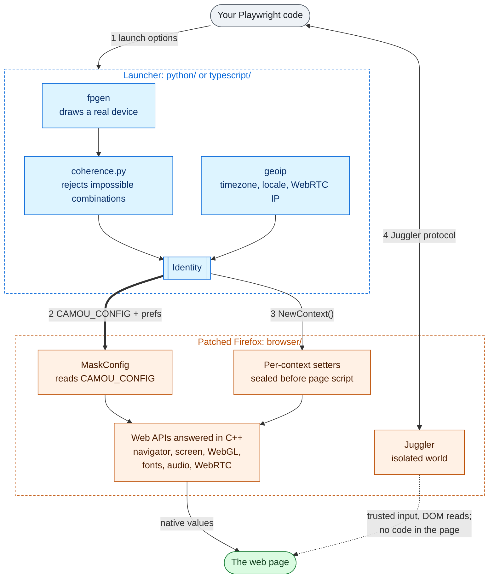
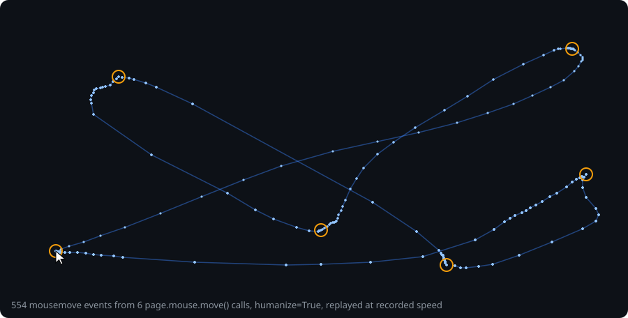
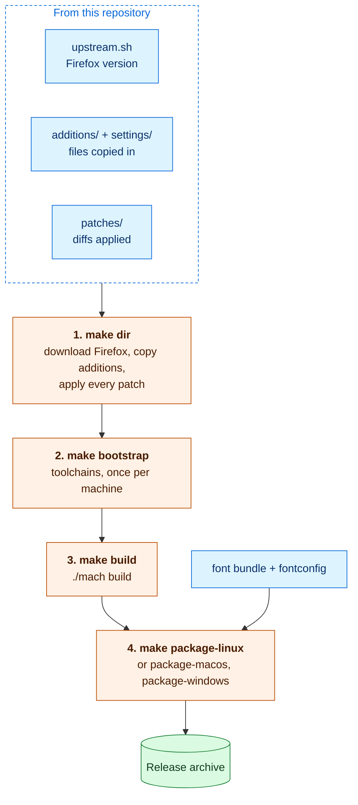
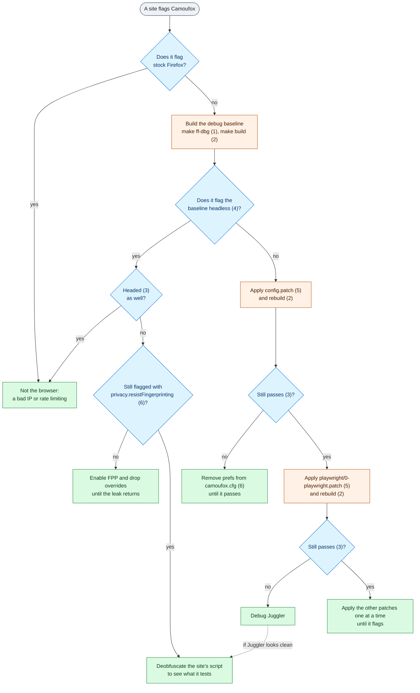

<h1 align="center">Camoufox</h1>

<h4 align="center">Camoufox is an open source anti-detect browser built for webscraping & AI agents. 🦊</h4>

<div align="center">
  <a href="https://trendshift.io/repositories/12224" target="_blank">
    
  </a><br>
  <a href="https://pepy.tech/projects/camoufox">
  <a href="https://pepy.tech/projects/camoufox"></a>
    <a href="https://pepy.tech/projects/camoufox"></a>
<h4>⚠️ This project is under development. It may not be suitable for stable production use. ⚠️</h4>
</div>

---

> [!NOTE]
> **All of the latest documentation is available at [camoufox.com](https://camoufox.com).**

---

# Sponsors

<details open id="sponsors">
<summary>View/Collapse All</summary>

## Premium

<table>
  <tr>
    <td width="25%" align="center" valign="middle">
      <a href="https://go.nodemaven.com/camoufoxghsept" target="_blank">
        
      </a>
    </td>
    <td valign="middle">
      <a href="https://go.nodemaven.com/camoufoxghsept">NodeMaven</a>: The most efficient proxy provider for Web Scrapping and Automation with the Highest Quality IP on the market.<br>
      <strong>Why <a href="https://go.nodemaven.com/camoufoxghsept">NodeMaven</a>?</strong><br>
      • 99.9% uptime<br>
      • ZIP Targeting<br>
      • IP filtering: all proxies have fraud score <97%<br>
      • No KYC required<br>
      • Unique free tools: Proxy Bandwidth Checker, Meta Tag Checker, IP Lookup and others!<br>
      <strong>Special codes for Camoufox users:</strong><br>
      • <code>CAMOUFOX35</code> - 35% off to Mobile and Residential Proxies<br>
      • <code>CAMOUFOX40</code> - 40% off to ISP (Static) Proxies<br>
    </td>
  </tr>
  <tr>
    <td width="25%" align="center" valign="middle">
      <a href="https://node-proxy.com" target="_blank">
        
      </a>
    </td>
    <td valign="middle">
      <strong>Need proxies for Camoufox?</strong><br>
      Use <strong><a href="https://node-proxy.com">Node Proxy</a></strong> — a provider of <strong>datacenter, residential and mobile proxies</strong> offering high speed, security and near-100% uptime. <strong>Fully tested and supported in Camoufox.</strong><br>
      <strong>What sets them apart from other providers</strong><br>
      • 90+ IP score<br>
      • HTTP + SOCKS5 — multiprotocol support<br>
      • Discounts for retail customers<br>
      • Full B2B support<br>
      • Ethically sourced IP addresses<br>
      • Special terms for Enterprise clients<br>
     <strong>Want to support Camoufox?</strong><br>
     Just use my promo code <strong><code>CAMOUFOX</code></strong> — it gets you a <strong>30% discount</strong> and supports the developer at the same time.<br>
     <strong><a href="https://node-proxy.com">Get started at node-proxy.com →</a></strong>
    </td>
  </tr>
  <tr>
    <td width="25%" align="center" valign="middle">
      <a href="https://byteful.com/?utm_source=github&utm_medium=github-sponsor&utm_campaign=camoufox_github_website_sponsor" target="_blank">
        
      </a>
    </td>
    <td valign="middle">
      <a href="https://byteful.com/?utm_source=github&utm_medium=github-sponsor&utm_campaign=camoufox_github_website_sponsor">Byteful</a> is a UK-based web data infrastructure platform that provides ethically sourced residential, mobile, static residential (ISP) and datacenter proxies alongside API-first tools for web scraping, data collection, and AI-driven automation.

Processing tens of billions of requests per month for thousands of customers, Byteful powers browser-based AI agents, automation systems, and data workflows. It is a member of the Internet Watch Foundation and the Ethical Web Data Collection Initiative.

Get 10% off Byteful Residential Bandwidth with the code: CAMOUFOX10
    </td>
  </tr>
  <tr>
    <td width="25%" align="center" valign="middle">
      <a href="https://layer3intel.com/?utm_source=github&utm_medium=sponsoring&utm_campaign=camoufox" target="_blank">
        
      </a>
    </td>
    <td valign="middle">
      <strong><a href="https://layer3intel.com/?utm_source=github&utm_medium=sponsoring&utm_campaign=camoufox">Layer3 Intel</a> | See your proxies the way anti-bots see them</strong><br>
      Camoufox hides your browser. Your proxy IP is the part it can't hide. Layer3 Intel is the residential proxy detection engine used to catch proxy traffic — check whether the IPs your provider sells you are clean, or already known and flagged.<br>
      • 🔍 Live threat score for any IP<br>
      • 🗂️ Proxy pool membership - identify IP resellers<br>
      • 📡 70M+ residential, mobile & ISP proxy IPs tracked across 200+ providers<br>
      • ⚡ <40ms API responses — vet IPs inline before your scraper uses them<br>
      Check your IPs: <a href="https://layer3intel.com/?utm_source=github&utm_medium=sponsoring&utm_campaign=camoufox">https://layer3intel.com</a>
    </td>
  </tr>
</table>

## Tools & Services
  
<table>
  <tr>
    <td width="25%" align="center" valign="middle">
      <a href="https://scrapfly.io/?utm_source=github&utm_medium=sponsoring&utm_campaign=camoufox" target="_blank">
        
      </a>
    </td>
    <td valign="middle">
      <a href="https://scrapfly.io/?utm_source=github&utm_medium=sponsoring&utm_campaign=camoufox">Scrapfly</a> is an enterprise-grade solution providing Web Scraping API that aims to simplify the scraping process by managing everything: real browser rendering, rotating proxies, and fingerprints (TLS, HTTP, browser) to bypass all major anti-bots. Scrapfly also unlocks the observability by providing an analytical dashboard and measuring the success rate/block rate in detail.
    </td>
  </tr>
  <tr>
    <td width="25%" align="center" valign="middle">
      <a href="https://cloverlabs.ai/?utm_source=github&utm_medium=sponsoring&utm_campaign=camoufox" target="_blank">
        
      </a>
    </td>
    <td valign="middle">
      <a href="https://cloverlabs.ai/?utm_source=github&utm_medium=sponsoring&utm_campaign=camoufox">Clover Labs</a> is a Toronto based venture studio building AI agents for growth and distribution.
    </td>
  </tr>
  <tr>
    <td width="25%" align="center" valign="middle" height="100">
      <a href="https://serpapi.com/use-cases/web-search-api?utm_source=camoufox" target="_blank">
        
      </a>
    </td>
    <td valign="middle">
      <a href="https://serpapi.com/use-cases/web-search-api?utm_source=camoufox">SerpApi, a web search API</a> to scrape Google and other search engines with a simple API.
    </td>
  </tr>
  <tr>
    <td width="25%" align="center" valign="middle" height="100">
      <a href="https://crawlbase.com/?utm_source=github&utm_medium=sponsorship&utm_campaign=camoufox" target="_blank">
        
      </a>
    </td>
    <td valign="middle">
      <strong>Web data that survives the anti-bots.</strong><br>
      <a href="https://crawlbase.com/?utm_source=github&utm_medium=sponsorship&utm_campaign=camoufox">Crawlbase</a> gives developers and AI teams reliable data at scale: a 99% success-rate Crawler, Crawling API, Smart AI Proxies, and Web MCP Server that get through, so your scrapers and agents don't break. You build, we handle the infrastructure.

<strong>Get 15% off your first 3 months with code CAMOUFOX</strong> → <a href="https://crawlbase.com/?utm_source=github&utm_medium=sponsorship&utm_campaign=camoufox">crawlbase.com</a>
    </td>
  </tr>
  <tr>
    <td width="25%" align="center" valign="middle">
      <a href="https://scrappey.com/?utm_source=camoufox&utm_medium=sponsorship&utm_campaign=camoufox_sponsorship" target="_blank">
        
      </a>
    </td>
    <td valign="middle">
      <a href="https://scrappey.com/?utm_source=camoufox&utm_medium=sponsorship&utm_campaign=camoufox_sponsorship">Scrappey</a> is a Web Scraping API that only charges successful scrapes with pay as you go - no subscriptions. Scrape complex sites. Residential proxies included, no hidden proxy fees, or expiring balances. One API for direct HTTP, full-browser rendering, JavaScript-heavy pages, screenshots, sessions, 30+ browser actions and 200+ concurrent sessions at a time - trusted by 1000+ developers and AI agents. Get 10% off with code CAMOUFOX.
    </td>
  </tr>
  <tr>
    <td width="25%" align="center" valign="middle">
      <a href="https://cloro.dev/?utm_source=referral&utm_medium=camoufox" target="_blank">
        
      </a>
    </td>
    <td valign="middle">
      <a href="https://cloro.dev/?utm_source=referral&utm_medium=camoufox">Cloro</a> is a SERP and AI search API. Get structured results from Google, ChatGPT, Perplexity, Gemini, Copilot and Grok.
    </td>
  </tr>
</table>

## Proxy Providers

Camoufox is intended to be used with rotating proxies (preferably residential IPs). Check out these providers:

<table>
  <tr>
    <td width="25%" align="center" valign="middle">
      <a href="https://proxyempire.io/?ref=camoufox&utm_source=github&utm_medium=paid_referral&utm_campaign=open_source_sponsorship&utm_content=camoufox" target="_blank">
        
      </a>
    </td>
    <td valign="middle">
      <b>🚀 Camoufox × ProxyEmpire</b><br>
      Running Camoufox? Your proxy layer decides whether you scale — or get blocked.<br>
      <a href="https://proxyempire.io/?ref=camoufox&utm_source=github&utm_medium=paid_referral&utm_campaign=open_source_sponsorship&utm_content=camoufox">ProxyEmpire</a> delivers:<br>
      • 🌍 30M+ Residential IPs (170+ countries)<br>
      • 📱 4G/5G Mobile Proxies<br>
      • 🔄 Rotating & Sticky Sessions<br>
      • ⚡ Unlimited Concurrent Sessions<br>
      • 🎯 Precise geo-targeting<br>
      • HTTP, HTTPS & SOCKS5 Support<br>
      Built for scraping, automation, and high-stealth workflows.<br>
      <b>🔥 Exclusive Offer</b> - Use code <b>Camoufox30</b><br>
      Get <b>30% recurring discount</b> (not just first month). Upgrade your proxies. Reduce bans. Scale properly
    </td>
  </tr>
  <tr>
    <td width="25%" align="center" valign="middle">
      <a href="https://www.rapidproxy.io/?ref=daijro" target="_blank">
        
      </a>
    </td>
    <td valign="middle">
      <a href="https://www.rapidproxy.io/?ref=daijro">RapidProxy</a> - Power Your Data with Premium Proxies.<br>
      🎁 Try proxies for free  + Use code <strong>RAPID10</strong> for <strong>10% OFF</strong>
      <br>
      <strong>Why Choose RapidProxy?</strong><br>
      • 🌍 90M+ IPs in 200+ countries & regions<br>
      • ♾️ No expiration on traffic — use anytime, no pressure<br>
      • 🔥 Unlimited concurrency for maximum performance<br>
      • 💰 Starting from just &#36;0.65/GB — built for scale<br>
      • 📍 City-level targeting for precise geo access<br>
      • 🔄 Flexible session control tailored to your needs<br>
      Don’t miss out — start your free trial today and experience fast, stable, and scalable proxy performance with <a href="https://www.rapidproxy.io/?ref=daijro">RapidProxy</a>.
    </td>
  </tr>
  <tr>
    <td width="25%" align="center" valign="middle">
      <a href="https://www.swiftproxy.net/?ref=daijro" target="_blank">
        
      </a>
    </td>
    <td valign="middle">
      <a href="https://www.swiftproxy.net/?ref=daijro">Swiftproxy</a> - <strong>High-Performance Residential Proxies for Scalable Data Collection</strong><br>
      Built for developers who need <strong>reliable</strong>, anti-detection proxy infrastructure. Swiftproxy delivers stable connections, high success rates, and flexible control for large-scale scraping and automation.<br>
      • 🌍 195+ locations with ethically sourced residential IPs<br>
      • 🔄 <strong>Rotating</strong> & <strong>sticky</strong> sessions with precise geo-targeting<br>
      • ⚡ Optimized for <strong>anti-ban</strong> & <strong>high success rate</strong><br>
      • 🔌 HTTP / HTTPS / SOCKS5 support<br>
      • 🧪 <strong>Free 500MB trial</strong> for testing<br>
      • 💸 <strong>Special discount</strong> code for Camoufox users: <strong>PROXY90 - 10%</strong><br>
      Best for: Web scraping, automation, multi-accounting, and large-scale data extraction
    </td>
  </tr>     
  <tr>
    <td width="25%" align="center" valign="middle">
      <a href="https://mangoproxy.com/?utm_source=github&utm_medium=partner&utm_campaign=daijro" target="_blank">
        
      </a>
    </td>
    <td valign="middle">
      <a href="https://mangoproxy.com/?utm_source=github&utm_medium=partner&utm_campaign=daijro">MangoProxy</a> is a Residential, ISP, Mobile and Datacenter proxy service designed for professional tasks where stability, speed, and anonymity matter.<br>
      Use code DAIJRO for 8% OFF ISP Static Proxies
    </td>
  </tr>
  <tr>
    <td width="25%" align="center" valign="middle">
      <a href="https://proxidize.com/?utm_source=github&utm_medium=sponsorship&utm_campaign=camoufox&utm_content=daijro" target="_blank">
        
      </a>
    </td>
    <td valign="middle">
      <strong><a href="https://proxidize.com/?utm_source=github&utm_medium=sponsorship&utm_campaign=camoufox&utm_content=daijro">Proxidize</a> | Mobile and Residential Proxies for Camoufox</strong><br>
      Running Camoufox at scale? Your browser setup is only half the stack. Your proxy layer matters too.<br>
      Proxidize provides mobile and residential proxies built for scraping, browser automation, SEO monitoring, AI agents, and data collection workflows.<br>
      <strong>Why Proxidize?</strong><br>
      • Real 4G and 5G mobile proxies<br>
      • Residential proxies in 195+ countries<br>
      • Rotating and sticky sessions<br>
      • City-level and carrier targeting<br>
      • Unlimited concurrency<br>
      • HTTP(S), SOCKS5, and UDP over SOCKS support<br>
      • No hardware or DIY setup required<br>
      Built for teams that need reliable proxy infrastructure without managing devices, servers, or proxy rotation themselves.<br>
      <strong>Special offer for Camoufox users</strong>: Use code <strong>CAMOUFOX20</strong> for <strong>20% off</strong>.<br>
      Start now: <a href="https://proxidize.com/?utm_source=github&utm_medium=sponsorship&utm_campaign=camoufox&utm_content=daijro">https://proxidize.com</a>
    </td>
  </tr>
  <tr>
    <td width="25%" align="center" valign="middle">
      <a href="https://niuproxy.com/?utm_source=camoufox&utm_medium=camoufox&ref=camoufox" target="_blank">
        
      </a>
    </td>
    <td valign="middle">
      <strong><a href="https://niuproxy.com/?utm_source=camoufox&utm_medium=camoufox&ref=camoufox">NiuProxy</a> | Rotating Residential Proxies from &#36;0.35/GB<br></strong>
      NiuProxy provides residential, ISP, mobile, and datacenter proxies for scraping, browser automation, SEO, AI agents, and data collection.<br>
      <strong>Why NiuProxy?</strong><br>
      • Residential proxies from &#36;0.35/GB<br>
      • ISP proxies from &#36;3/IP<br>
      • Mobile proxies from &#36;1.5/GB<br>
      • Datacenter proxies from &#36;0.5/GB<br>
      • HTTP(S) & SOCKS5 support<br>
      • Flexible geo targeting and sessions<br>
      • Alipay, USDT, cards, Google Pay & Apple Pay<br>
      Special offer for Camoufox users: Use code PAY2 for 10% off your recharge.<br>
      Start now: <a href="https://niuproxy.com/?utm_source=camoufox&utm_medium=camoufox&ref=camoufox">https://niuproxy.com</a>
    </td>
  </tr>
  <tr>
    <td width="25%" align="center" valign="middle">
      <a href="https://www.thordata.com/?ls=dcx&lk=dcx" target="_blank">
        
      </a>
    </td>
    <td valign="middle">
      <b>🔍 Camoufox × Thordata</b><br>
      <b>Real Residential IPs for Smarter AI Agents & Automation</b><br>
      With <strong>100M+ residential IPs</strong>, Thordata helps your scraper access the web through real user IPs across <strong>195+ countries</strong>.<br>
      Target specific locations with precision — including <strong>city, ISP, and ASN-level targeting</strong> — so your Camoufox automation runs with a more authentic network identity.<br>
      • 🔄 <strong>Rotating & Sticky Sessions</strong> (up to 90 minutes)<br>
      • ⚡ <strong>99.99% uptime</strong> with unlimited concurrent sessions<br>
      • 🌍 <strong>Global residential coverage</strong> for AI agents, scraping, and automation workflows<br>
      🎁 <strong>Exclusive for Camoufox users:</strong><br>
      Get free trial traffic after signup + use code <strong>Camoufox</strong> for <strong>10% OFF</strong>.<br>
      <a href="https://www.thordata.com/?ls=dcx&lk=dcx" target="_blank">Start your free trial with Thordata</a>
  </tr>
  <tr>
    <td width="25%" align="center" valign="middle">
      <a href="https://www.webshare.io/" target="_blank">
        
      </a>
    </td>
    <td valign="middle">
      <strong><a href="https://www.webshare.io/">Webshare</a></strong> gives you instant access to a proxy pool of 80M+ ethically-sourced IPs across 195+ countries, with rotating residential, static ISP, and datacenter options plus a full API. It includes a 100+ Gbps backbone, country/city/state/ZIP/ASN-level targeting, and requires no credit card to start.<br>
      🏷️ Get <strong>20% OFF your first purchase</strong> with promo code <strong><code>CAMOUFOX20</code></strong>
  </tr>
  <tr>
    <td width="25%" align="center" valign="middle">
      <a href="https://roamproxy.com" target="_blank">
        
      </a>
    </td>
    <td valign="middle">
      <strong><a href="https://roamproxy.com">Roam</a></strong> — Residential & static residential proxies, pay-as-you-go per GB. Use code CAMOUFOX15 for 15% extra credit on your first top-up.
  </tr>
</table>
</details>

---

# Introduction

Camoufox is a Firefox build for web scraping and AI agents. Every launch gets a
fresh, internally consistent device identity drawn from the real-world
distribution of devices, and the browser reports it from C++, so a page sees
native values rather than JavaScript overrides. Playwright drives it, through
an automation layer the page cannot see.

| Package | Install | Docs |
|---|---|---|
| Python | `pip install -U "camoufox[geoip]"` | [`python/README.md`](python/README.md) |
| TypeScript / Node.js | `npm install camoufox playwright-core` | [`typescript/README.md`](typescript/README.md) |
| AI coding agents | | [`AGENTS.md`](AGENTS.md#using-camoufox) |

## Quick start

```bash
pip install -U "camoufox[geoip]"
camoufox fetch
```

```python
from camoufox.sync_api import Camoufox

with Camoufox(headless=True) as browser:
    page = browser.new_page()
    page.goto("https://example.com")
```

```python
import asyncio
from camoufox.async_api import AsyncCamoufox

async def main():
    async with AsyncCamoufox(headless=True) as browser:
        page = await browser.new_page()
        await page.goto("https://example.com")

asyncio.run(main())
```

```javascript
// npm install camoufox playwright-core && npx camoufox fetch
import { Camoufox } from "camoufox";

const browser = await Camoufox({ headless: true });
const page = await browser.newPage();
await page.goto("https://example.com");
await browser.close();
```

What you get back is a normal Playwright `Browser`. Behind a proxy, add
`proxy=...` and `geoip=True` so timezone, locale, geolocation and the WebRTC IP
match the exit IP. For many identities in one browser, use `NewContext()`.

## How it fits together


```mermaid
flowchart TB
    YOU(["Your Playwright code"])

    subgraph L["Launcher: python/ or typescript/"]
        FP["fpgen<br/>draws a real device"] --> CO["coherence.py<br/>rejects impossible combinations"]
        CO --> ID[["Identity"]]
        GEO["geoip<br/>timezone, locale, WebRTC IP"] --> ID
    end

    subgraph B["Patched Firefox: browser/"]
        MC["MaskConfig<br/>reads CAMOU_CONFIG"] --> API["Web APIs answered in C++<br/>navigator, screen, WebGL,<br/>fonts, audio, WebRTC"]
        SET["Per-context setters<br/>sealed before page script"] --> API
        JG["Juggler<br/>isolated world"]
    end

    PAGE(["The web page"])

    YOU -- "1 launch options" --> L
    ID == "2 CAMOU_CONFIG + prefs" ==> MC
    ID -- "3 NewContext()" --> SET
    YOU <-- "4 Juggler protocol" --> JG
    API -- "native values" --> PAGE
    JG -. "trusted input, DOM reads;<br/>no code in the page" .-> PAGE

    classDef you fill:#eef2f6,stroke:#57606a,color:#1f2328
    classDef launcher fill:#ddf4ff,stroke:#0969da,color:#0a3069
    classDef browser fill:#fff1e5,stroke:#bc4c00,color:#4a1c00
    classDef page fill:#dafbe1,stroke:#1a7f37,color:#0f3d1c
    class YOU you
    class FP,CO,ID,GEO launcher
    class MC,API,SET,JG browser
    class PAGE page
    style L fill:none,stroke:#0969da,stroke-dasharray:4 3,color:#0969da
    style B fill:none,stroke:#bc4c00,stroke-dasharray:4 3,color:#bc4c00
```

1. The launcher draws a device from [fpgen](https://github.com/scrapfly/fingerprint-generator)
   (a model of real traffic), then adds fonts, voices, a GPU and media devices
   seeded by that identity. `coherence.py` rejects combinations no real machine
   produces.
2. The identity goes to the browser as the `CAMOU_CONFIG` environment variable
   (keys declared in [`browser/settings/properties.json`](browser/settings/properties.json)).
   The patches read it through `MaskConfig` and answer from C++.
3. `NewContext()` gives one context its own identity through setters that the
   per-context patches add to `window`. They are sealed before page script runs.
4. Playwright talks to Juggler. Camoufox's Juggler runs its page agent in an
   isolated world, so the page never sees automation code.

# Features

Each row says where it is implemented. A **patch** is a file in
[`browser/patches/`](browser/patches); **Juggler** is
[`browser/additions/juggler/`](browser/additions/juggler); the **launcher** is
the Python and TypeScript packages.

### Fingerprint spoofing

The goal is a browser that behaves exactly like stock Firefox, except that it
reports a different machine. A value is spoofed when it identifies the host
machine or the network. Anything else stays as Firefox has it, because
something stock Firefox never does, such as noise, is a fingerprint in its own
right.

| Trait | What a page sees | Why it is spoofed | Where |
|---|---|---|---|
| Navigator: User-Agent, platform, oscpu, hardware concurrency, language, appVersion | The drawn device's values, per launch or per context, in workers too | They name the OS and hardware directly, and every other value is checked against them | `navigator-spoofing`, `fingerprint-injection` patches |
| HTTP headers: User-Agent, Accept-Language | The navigator values | Servers compare the headers with what script reports | `network-patches` patch |
| Screen and window sizes, color depth, CSS media features | The drawn device's display, the same in JS and CSS | Screen size is among the most identifying values, and CSS media queries read it without script | `screen-spoofing`, `fingerprint-injection` patches |
| WebGL and WebGL2: vendor, renderer, parameters, extensions, shader precision, context attributes | One GPU fpgen recorded for Firefox on that OS. Values Firefox decides rather than the GPU follow the shipped Firefox ([`webgl-browser-owned-values-follow-firefox`](ci/tribal-rules.yml)) | The renderer string names the host's GPU, and its limits must agree with it | `webgl-spoofing` patch, `webgl.py` |
| WebGPU: `navigator.gpu` and its adapter | `navigator.gpu` only where Firefox on the claimed device has it: Windows and Apple Silicon Macs. The adapter is the host's only when the identity claims the host's GPU; otherwise `requestAdapter()` returns `null`, as for a blocked or software GPU | The adapter's limits and features come from the real GPU | launcher, `host_rendering.py` |
| Audio: sample rate, output latency, max channels, and the audio fingerprint | The identity's values, seeded per identity | Audio output varies with hardware and drivers, so identities sharing one could be linked | `audio-context-spoofing`, `audio-fingerprint-manager` patches |
| Fonts: installed list, `system-ui`, CSS2 system fonts | The claimed OS's fonts, from a bundled set; see [docs/FONTS.md](docs/FONTS.md) | Installed fonts reveal the OS and the software on it | `font-list-spoofing`, `font-hijacker`, `system-ui-font-spoofing` patches |
| Speech voices | The claimed OS's voices, which actually speak | The voice list is specific to each OS, and a voice that cannot speak is a tell | `voice-spoofing`, `speech-voices-spoofing` patches |
| Microphones, cameras, speakers | OS-style labels and groups; see [docs/MEDIA-DEVICES.md](docs/MEDIA-DEVICES.md) | Device count and labels differ per machine and per OS | `media-device-spoofing` patch |
| Media codecs (`canPlayType`, `isTypeSupported`) | Not the host's codec libraries | On Linux the answer depends on the host's installed codec libraries | `media-codec-spoofing` patch |
| Timezone, locale and `Intl` | The identity's, per realm, workers included | They must agree with the IP's country | `timezone-spoofing`, `locale-spoofing` patches |
| Geolocation | Coordinates from GeoIP, permission granted | They must agree with the IP | `geolocation-spoofing` patch, launcher |
| WebRTC IP | ICE candidates, SDP and `getStats()` rewritten to the proxy IP | WebRTC otherwise reveals the real IP behind a proxy | `webrtc-ip-spoofing` patch |
| Touchscreen | A touchscreen laptop, not a phone | Touch points and pointer media must agree with the claimed device | `touchscreen-fingerprint-spoofing`, `force-default-pointer` patches |

Left as stock Firefox has it, on purpose:

| Trait | What a page sees | Why it is not spoofed |
|---|---|---|
| Canvas pixels | What the GPU and fonts produce. As in stock Firefox, each context's PNG exports (`toDataURL`, `toBlob`) carry a per-session `deBG` chunk; the pixels themselves are untouched. On the host's OS the identity claims the host's GPU, so the pixels agree with it; on another OS readback returns random data, as `privacy.resistFingerprinting` does in LibreWolf ([the canvas on another OS](python/README.md#the-canvas-on-another-os)) | Stock Firefox does not perturb pixels in its default configuration, so noise would only mark the browser as a spoofer ([`canvas-is-not-noised`](ci/tribal-rules.yml)) |
| Text widths | What the font really measures | The same font on the same OS measures the same everywhere; widths no real machine produces are a fingerprint ([`no-glyph-spacing-noise`](ci/tribal-rules.yml)) |

Each context of one browser can carry its own identity:
[docs/per-context-patches.md](docs/per-context-patches.md).

### Canvas

Canvas and WebGL pixels come from the real OS, driver and GPU, whatever the
identity claims. The launcher chooses the canvas behaviour from two facts: does
the identity claim the host's OS, and does the host render on a GPU?

| | Identity on the host's OS | Identity on another OS |
|---|---|---|
| **GPU rendering** | 🟢 <ins><b>Most stealthy</b></ins><br/>&nbsp;&nbsp;&nbsp;&nbsp;✅ No canvas noise: looks like stock Firefox<br/>&nbsp;&nbsp;&nbsp;&nbsp;✅ The claimed GPU is the host's, so the pixels agree with it<br/>&nbsp;&nbsp;&nbsp;&nbsp;⛔ Every identity on this machine claims the same GPU, so there is less fingerprint diversity | 🟡 <ins><b>Less stealthy</b></ins><br/>&nbsp;&nbsp;&nbsp;&nbsp;✅ Readback is random, so the real OS does not show<br/>&nbsp;&nbsp;&nbsp;&nbsp;✅ A GPU is drawn per identity, so identities differ<br/>&nbsp;&nbsp;&nbsp;&nbsp;⛔ Canvas noise: looks like LibreWolf, Tor Browser or Mullvad Browser, which are rarer than stock Firefox |
| **Software rendering**<br/>(no GPU driver, as on most servers) | 🟢 <ins><b>Stealthy</b></ins><br/>&nbsp;&nbsp;&nbsp;&nbsp;✅ No canvas noise: looks like stock Firefox<br/>&nbsp;&nbsp;&nbsp;&nbsp;✅ A GPU is drawn per identity, so identities differ<br/>&nbsp;&nbsp;&nbsp;&nbsp;⛔ Looks like a GPU falling back to software rendering, which is rarer than a working GPU | 🟡 <ins><b>Less stealthy</b></ins><br/>&nbsp;&nbsp;&nbsp;&nbsp;✅ Readback is random, so the real OS does not show<br/>&nbsp;&nbsp;&nbsp;&nbsp;✅ A GPU is drawn per identity, so identities differ<br/>&nbsp;&nbsp;&nbsp;&nbsp;⛔ Canvas noise: looks like LibreWolf, Tor Browser or Mullvad Browser, which are rarer than stock Firefox |

That is the default. These options override it:

| Override | Result |
|---|---|
| `canvas_noise=False` on another OS | 🔴 Stock Firefox, but the pixels show the real OS |
| `canvas_noise=True` on the host's OS | 🟡 Looks like LibreWolf with no need to |
| `webgl_config` naming a GPU other than the host's, without noise | 🔴 WebGL reports one GPU while the pixels come from another |

Noise is set per browser, not per context. Without it, every `NewContext()`
claims the host's OS. Details are in
[the canvas on another OS](python/README.md#the-canvas-on-another-os).

### Hiding automation

| What | Where |
|---|---|
| Playwright's `evaluate`, selectors and init scripts run in an isolated world the page cannot see | Juggler |
| `navigator.webdriver` is `false` | `playwright/1-leak-fixes` patch |
| `select_option`, `fill` on date and colour inputs, and `set_input_files` fire trusted events | `trusted-automation-events` patch |
| Headless reports a fine pointer, like a desktop | `force-default-pointer` patch |
| Wheel events carry native ticks, like a physical wheel | `wheel-native-ticks` patch |
| Juggler's debugger leaves no side effects content can observe | `debugger-invisible-to-content` patch |
| Per-context fingerprint setters are gone before page script runs | `window-setter-seal` patch |
| Popup blocker on, as in stock Firefox | `popup-blocker-parity` patch |
| Content-accessible chrome files match stock Firefox | `contentaccessible-parity` patch |
| Viewports never enter Responsive Design Mode; containers show no automation label | Juggler |

### Automation

| Feature | How to use it | Where |
|---|---|---|
| Human cursor movement, replayed from 2356 recordings of real people ([Cursory](https://github.com/Vinyzu/cursory)) | `humanize=True`, or a number of seconds to cap each move | Juggler `input/` |
| Run code in the page's own world | `main_world_eval=True`, then `page.evaluate("mw:...")` | Juggler |
| Finish animations at once so Playwright never waits | `config={"instantAnimations": True}` (detectable; warns) | `no-css-animations` patch |
| Read closed shadow roots | `config={"forceScopeAccess": True}` | `shadow-root-bypass` patch |
| Many identities in one browser | `NewContext(browser, os=..., proxy=...)` | per-context patches, launcher |

### Addons

| Feature | Where |
|---|---|
| Load extracted addons without a debug server: `addons=["/path/to/addon"]` | launcher, `camoufox-window-module` patch |
| uBlock Origin installed by default, with its own default filter lists (`exclude_addons=[DefaultAddons.UBO]` to drop it) | launcher |
| Addons cannot open tabs unless `allow_addon_new_tab=True` | `disable-extension-newtab` patch |
| Addons run in private browsing | `all-addons-private-mode` patch |

### Launcher

| Feature | Option or command |
|---|---|
| Identity drawn from fpgen's real-world distribution, checked for coherence | default |
| Recorded real-device presets instead of fpgen | `fingerprint_preset=True` |
| Timezone, locale, geolocation and WebRTC IP from the proxy's exit IP | `proxy=..., geoip=True` |
| Locale chosen by the languages spoken in the IP's region | `geoip=True` without `locale` |
| Headed browser on a private Xvfb display (Linux) | `headless="virtual"` |
| Remote Playwright server for other languages | `launch_server()`, `camoufox server` |
| Install, pin and switch browser builds | `camoufox fetch`, `set`, `list`, `remove` |
| Core count that a page can measure | `pin_cpu_cores=True` |
| Block images, WebRTC or WebGL | `block_images`, `block_webrtc`, `block_webgl` |
| The host's GPU on the host's OS; random canvas readback, as in LibreWolf, on another OS | default; `canvas_noise=True` or `False` to choose |

The full option list is in the [Python README](python/README.md#launch-options).

### Debloat

| What | Where |
|---|---|
| Telemetry and data reporting removed at compile time | `librewolf/` patches |
| Onboarding messages disabled | `ghostery/` patch |
| No bundled search engines | `no-search-engines` patch |
| Mozilla services and background traffic turned off | [`browser/settings/camoufox.cfg`](browser/settings/camoufox.cfg) |
| Stock browser UI: no theme, toolbar or dialog changes | |

> [!NOTE]
> Camoufox presents Firefox identities only. Some WAFs test SpiderMonkey engine
> behaviour, which no amount of spoofing turns into Chromium.

# How Camoufox compares

| | JavaScript injection | CDP-based (Chromium) | Camoufox |
|---|---|---|---|
| Where values are spoofed | Page-world overrides | Page-world overrides or flags | Browser C++ |
| `toString()`, property descriptors | Show the override | Show the override | Native |
| Workers and iframes | Often missed | Often missed | Same value everywhere |
| Headers agree with navigator | Only if set separately | Only if set separately | Always |
| Automation code in the page | Yes | Yes (bindings, `navigator.webdriver`) | No: isolated world |
| Identity source | Hand-picked or random | Hand-picked or random | fpgen's real-world distribution, coherence-checked |

Playwright drives Chromium over CDP but Firefox over Juggler, a protocol that is
a separate module inside Firefox. That makes it possible to give Juggler its
own copy of the page: Playwright reads and edits that copy, and the real page
never sees a getter fire or a listener appear. Input goes through Firefox's own
input handlers, so it is handled as a user's would be.

Camoufox can still be detected. Thousands of values must agree with each other,
and anti-bot vendors look for the one that does not. File a
[detection report](https://github.com/daijro/camoufox/issues/new?template=camoufox-detected.md)
when you find one.

## Human cursor



Each dot is a `mousemove` event the page received from six `page.mouse.move()`
calls with `humanize=True`, shown at the speed it arrived; close dots mean the
hand slowed down. `browser/scripts/cursor-demo.py` regenerates the figure.

Camoufox does not compute its cursor paths. It picks one of Cursory's 2356
recorded human movements that suits the move, morphs it onto the start and end
points, and replays it with the recording's own timing, including pauses and
overshoots. It ships [cursory-js](https://github.com/JWriter20/cursory-js), a
TypeScript port that reproduces the Python original exactly, at
`browser/additions/juggler/input/cursory/`. **Cursory is LGPLv3-or-later, not
MPL-2.0 like the rest of the browser**; see
[`NOTICE`](browser/additions/juggler/input/cursory/NOTICE).

# Building the browser

This repository is not the Firefox source. It fetches Firefox, copies in
[`browser/additions/`](browser/additions), applies
[`browser/patches/`](browser/patches) and builds. The build runs on Linux; the
Windows and macOS binaries are cross-compiled. WSL does not work.


```mermaid
flowchart TB
    subgraph IN["From this repository"]
        direction LR
        UP["upstream.sh<br/>Firefox version"]
        ADD["additions/ + settings/<br/>files copied in"]
        PAT["patches/<br/>diffs applied"]
    end

    S1["<b>1. make dir</b><br/>download Firefox, copy additions,<br/>apply every patch"]
    S2["<b>2. make bootstrap</b><br/>toolchains, once per machine"]
    S3["<b>3. make build</b><br/>./mach build"]
    S4["<b>4. make package-linux</b><br/>or package-macos, package-windows"]
    FONTS["font bundle + fontconfig"]
    OUT[("Release archive")]

    IN --> S1 --> S2 --> S3 --> S4 --> OUT
    FONTS --> S4

    classDef input fill:#ddf4ff,stroke:#0969da,color:#0a3069
    classDef step fill:#fff1e5,stroke:#bc4c00,color:#4a1c00
    classDef out fill:#dafbe1,stroke:#1a7f37,color:#0f3d1c
    class UP,ADD,PAT,FONTS input
    class S1,S2,S3,S4 step
    class OUT out
    style IN fill:none,stroke:#0969da,stroke-dasharray:4 3,color:#0969da
```

```bash
git clone --depth 1 https://github.com/daijro/camoufox
cd camoufox/browser
make dir                        # fetch Firefox, copy additions, apply every patch
make bootstrap                  # one time: host packages and mach bootstrap
make build                      # ./mach build
make run                        # run the build
make package-linux arch=x86_64  # or package-macos / package-windows
```

`make help` lists every target. Install `ccache`: a cold build takes about 40
minutes and an incremental one about 5.

To build and package several targets in one go:

```bash
python3 multibuild.py --target linux windows macos --arch x86_64 arm64
```

| `multibuild.py` flag | Values |
|---|---|
| `--target` | `linux`, `windows`, `macos` (one or more) |
| `--arch` | `x86_64`, `arm64`, `i686` (one or more; `i686` builds Windows only) |
| `--bootstrap` | Bootstrap the build system first |
| `--clean` | Clean the build directory first |

Artifacts are written to `browser/dist/`.

### With Docker

```bash
cd browser
docker build -t camoufox-builder .
docker run -v "$(pwd)/dist:/app/dist" camoufox-builder --target linux --arch x86_64
```

The container takes the `multibuild.py` flags. Add
`-v "$HOME/.mozbuild":/root/.mozbuild:rw,z` to reuse the host's toolchains.

### Changing patches and running tests

| Task | Where |
|---|---|
| Write or edit a patch | [`AGENTS.md`](AGENTS.md#changing-a-patch) |
| Port patches to a new Firefox | [`docs/patch-upgrading-guide.md`](docs/patch-upgrading-guide.md) |
| Which suite to run for a change | [`AGENTS.md`](AGENTS.md#testing) |
| The CI pipeline and running any job locally | [`ci/README.md`](ci/README.md) |
| Contributing | [`CONTRIBUTING.md`](CONTRIBUTING.md) |

## Leak debugging

A way to find what a site detects without deobfuscating its JavaScript: start
from stock Firefox and add Camoufox's changes back until the site flags.

<details>
<summary>Leak debugging flow chart</summary>


```mermaid
flowchart TD
    START(["A site flags Camoufox"]) --> Q1{"Does it flag<br/>stock Firefox?"}
    Q1 -- yes --> NB["Not the browser:<br/>a bad IP or rate limiting"]
    Q1 -- no --> BASE["Build the debug baseline<br/>make ff-dbg (1), make build (2)"]
    BASE --> Q2{"Does it flag the<br/>baseline headless (4)?"}

    Q2 -- yes --> Q3{"Headed (3)<br/>as well?"}
    Q3 -- yes --> NB
    Q3 -- no --> Q4{"Still flagged with<br/>privacy.resistFingerprinting (6)?"}
    Q4 -- no --> FPP["Enable FPP and drop overrides<br/>until the leak returns"]
    Q4 -- yes --> DEOB["Deobfuscate the site's script<br/>to see what it tests"]

    Q2 -- no --> CFG["Apply config.patch (5)<br/>and rebuild (2)"]
    CFG --> Q5{"Still passes (3)?"}
    Q5 -- no --> PREFS["Remove prefs from camoufox.cfg (6)<br/>until it passes"]
    Q5 -- yes --> PW["Apply playwright/0-playwright.patch (5)<br/>and rebuild (2)"]
    PW --> Q6{"Still passes (3)?"}
    Q6 -- no --> JUG["Debug Juggler"]
    Q6 -- yes --> REST["Apply the other patches one at a time<br/>until it flags"]
    JUG -. "if Juggler looks clean" .-> DEOB

    classDef start fill:#eef2f6,stroke:#57606a,color:#1f2328
    classDef ask fill:#ddf4ff,stroke:#0969da,color:#0a3069
    classDef step fill:#fff1e5,stroke:#bc4c00,color:#4a1c00
    classDef found fill:#dafbe1,stroke:#1a7f37,color:#0f3d1c
    class START start
    class Q1,Q2,Q3,Q4,Q5,Q6 ask
    class BASE,CFG,PW step
    class NB,FPP,DEOB,PREFS,JUG,REST found
```

| # | Command | What it does |
|---|---|---|
| 1 | `make ff-dbg` | Stock Firefox with the minimum Camoufox needs |
| 2 | `make build` | Build |
| 3 | `make run` | Run the build |
| 4 | `make run args="--headless https://example.com"` | Run headless |
| 5 | `make patch ./patches/<name>.patch` | Apply one patch (`make unpatch` reverses it) |
| 6 | `make edit-cfg` | Edit `camoufox.cfg` |

</details>

---

## Licensing

| Part | Licence |
|---|---|
| The browser (`browser/`: patches, additions, settings, build system) | [MPL-2.0](LICENSE), the licence of the Firefox source it modifies |
| Vendored Cursory trajectories | LGPLv3-or-later ([`NOTICE`](browser/additions/juggler/input/cursory/NOTICE)) |
| Python package | MIT ([`python/LICENSE`](python/LICENSE)) |
| TypeScript package | MIT ([`typescript/LICENSE`](typescript/LICENSE)); includes a port of NumPy's pairwise summation ([notice](typescript/THIRD_PARTY_NOTICES.md)) and depends on [`fpgen`](https://www.npmjs.com/package/fpgen) (Apache-2.0) and [`python-random`](https://www.npmjs.com/package/python-random) |

## Thanks

| Project | Used for |
|---|---|
| [LibreWolf](https://gitlab.com/librewolf-community/browser/source) | Debloat patches and the original build system |
| [BetterFox](https://github.com/yokoffing/BetterFox) | Speed and debloat preferences |
| [Ghostery](https://github.com/ghostery/user-agent-desktop) | Debloat reference ([disable onboarding](browser/patches/ghostery/Disable-Onboarding-Messages.patch)) |
| [Vinyzu/cursory](https://github.com/Vinyzu/cursory) | The recorded human mouse movements behind `humanize=True`, vendored via [cursory-js](https://github.com/JWriter20/cursory-js) |
| [riflosnake/HumanCursor](https://github.com/riflosnake/HumanCursor) | The Bézier cursor Camoufox used before Cursory |
| [scrapfly/fingerprint-generator](https://github.com/scrapfly/fingerprint-generator) (fpgen) | The device distribution identities are drawn from |
| [CreepJS](https://github.com/abrahamjuliot/creepjs), [Browserleaks](https://browserleaks.com), [BrowserScan](https://www.browserscan.net/) | Leak testing |
