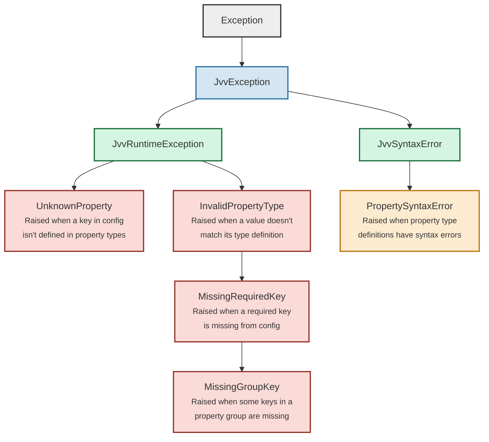

# JSONvv

JSON value validator

## Overview

This is a simple JSON schema validator library. It was created for Camoufox to validate passed user configurations. Because I found it useful for other projects, I decided to extract it into a separate library.

JSONvv's syntax parser is written in pure Python. It does not rely on any dependencies.

### Example

<table>
<tr>
<th width="50%">Configuration</th>
<th width="50%">Validator</th>
</tr>
<tr>
<td width="50%">

```python
config = {
    "username": "johndoe",
    "email": "johndoe@example.com",
    "age": 30,
    "chat": "Hello world!",
    "preferences": {
        "notifications": True,
        "theme": "dark"
    },
    "allowed_commands": [
        "/help", "/time", "/weather"
    ],
    "location": [40.7128, -74.0060],
    "hobbies": [
        {
            "name": "Traveling",
            "cities": ["Paris", "London"]
        },
        {
            "name": "reading",
            "hours": {
                "Sunday": 2,
                "Monday": 3,
            }
        }
    ]
}
```

</td>
<td width="50%">

```python
validator = {
    "username": "str",  # Basic username
    "email": "str[/\S+@\S+\.\S+/]",  # Validate emails
    "age": "int[>=18]",  # Age must be 18 or older
    "chat": "str | nil",  # Optional chat message
    "preferences": {
        "notifications": "bool",
        "theme": "str[light, dark] | nil",  # Optional theme
    },
    # Commands must start with "/", but not contain "sudo"
    "allowed_commands": "array[str[/^//] - str[/sudo/]]",
    # Validate coordinate ranges
    "location": "tuple[double[-90 - 90], double[-180 - 180]]",
    # Handle an array of hobby types
    "hobbies": "array[@traveling | @other, >=1]",
    "@traveling": {
        # Require 1 or more cities/countries iff name is "Traveling"
        "*name,type": "str[Traveling]",
        "*cities,countries": "array[str[A-Za-z*], >=1]",
    },
    "@other": {
        "name,type": "str - str[Traveling]",  # Non-traveling types
        # If hour(s) is specified, require days have >0 hours
        "/hours?/": {
            "*/day$/": "int[>0]"
        }
    }
}
```

</td>
</tr>
</table>

<hr width=50>

Then, validate the configuration like this:

```python
from jsonvv import JsonValidator, JvvRuntimeException

val = JsonValidator(validator)
try:
   val.validate(config)
except JvvRuntimeException as exc:
   print("Failed:", exc)
else:
   print('Config is valid!')
```

---

## Table of Contents

- [Key Syntax](#key-syntax)
  - [Regex patterns](#regex-patterns)
  - [Lists of possible values](#lists-of-possible-values)
  - [Required fields (`*`)](#required-fields-)
  - [Grouping keys (`$`)](#grouping-keys-)
- [Supported Types](#supported-types)
  - [String (`str`)](#string-str)
  - [Integer (`int`)](#integer-int)
  - [Double (`double`)](#double-double)
  - [Boolean (`bool`)](#boolean-bool)
  - [Array (`array`)](#array-array)
  - [Tuple (`tuple`)](#tuple-tuple)
  - [Nested Dictionaries](#nested-dictionaries)
  - [Nil (`nil`)](#nil-nil)
  - [Any (`any`)](#any-any)
  - [Required fields (`*`)](#required-fields-)
  - [Type References (`@`)](#type-references-)
- [Advanced Features](#advanced-features)
  - [Subtracting Domains (`-`)](#subtracting-domains--)
  - [Union Types (`|`)](#union-types-)
  - [Conditional Ranges and Values](#conditional-ranges-and-values)
- [Error Handling](#error-handling)

---

## Keys Syntax

Dictionary keys can be specified in several possible ways:

- `"key": "type"`
- `"key1,key2,key3": "type"`
- `"/key\d+/": "type"`
- `"*required_key": "type"`

### Regex patterns

To use regex in a key, wrap it in `/ ... /`.

**Syntax:**

```python
"/key\d+/": "type"
```

### Lists of possible values

To specify a list of keys, use a comma-separated string.

**Syntax:**

```python
"key1,key2,key3": "type"
"/k[ey]{2}1/,key2": "type"
```

To escape a comma, use `!`.

### Required fields (`*`)

Fields marked with `*` are required. The validation will fail without them.

**Syntax:**

```python
"*key1": "type"
"*/key\d+/": "type"
```

### Grouping keys (`$`)

Fields that end with `$group_name` are grouped together. If one of the keys is set, all of the keys in the group must also be set as well.

**Syntax:**

```python
"isEnabled$group1": "bool"
"value$group1": "int[>0]"
```

This will require both `value` is set if and only if `isEnabled` is set.

Multiple `$` can be used to create more complex group dependencies.

---

## Supported Types

### String (`str`)

Represents a string value. Optionally, you can specify a regex pattern that the string must match.

**Syntax:**

- Basic string: `"str"`
- With regex pattern: `"str[regex_pattern]"`
- The escape character for regex is `\`, and for commas is `_`.

**Arguments:**

- `regex_pattern`: A regular expression that the string must match. If not specified, any string is accepted.

**Examples:**

1. Basic string:

   ```python
   "username": "str"
   ```

   Accepts any string value for the key `username`.

2. String with regex pattern:

   ```python
   "fullname": "str[/[A-Z][a-z]+ [A-Z][a-z]+/]"
   ```

   Accepts a string that matches the pattern of a first and last name starting with uppercase letters.

### Integer (`int`)

Represents an integer value. You can specify conditions like exact values, ranges, and inequalities.

**Syntax:**

- Basic integer: `"int"`
- With conditions: `"int[conditions]"`

**Arguments:**

- `conditions`: A comma-separated list of conditions.

**Condition Operators:**

- `==`: Equal to a specific value.
- `>=`: Greater than or equal to a value.
- `<=`: Less than or equal to a value.
- `>`: Greater than a value.
- `<`: Less than a value.
- `range`: A range between two values (inclusive).

**Examples:**

1. Basic integer:

   ```python
   "age": "int"
   ```

   Accepts any integer value for the key `age`.

2. Integer with conditions:

   ```python
   "userage": "int[>=0, <=120]"
   ```

   Accepts integer values between 0 and 120 inclusive.

3. Specific values and ranges

   ```python
   "rating": "int[1-5]"
   "rating": "int[1,2,3,4-5]"
   ```

   Accepts integer values 1, 2, 3, 4, or 5.

4. Ranges with negative numbers:

   ```python
   "rating": "int[-100 - -90]"
   ```

   Accepts integer values from -100 to -90.

### Double (`double`)

Represents a floating-point number. Supports the same conditions as integers.

**Syntax:**

- Basic double: `"double"`
- With conditions: `"double[conditions]"`

**Arguments:**

- `conditions`: A comma-separated list of conditions.

**Examples:**

1. Basic double:

   ```python
   "price": "double"
   ```

   Accepts any floating-point number for the key `price`.

2. Double with conditions:

   ```python
   "percentage": "double[>=0.0,<=100.0]"
   ```

   Accepts double values between 0.0 and 100.0 inclusive.

### Boolean (`bool`)

Represents a boolean value (`True` or `False`).

**Syntax:**

```python
"isActive": "bool"
```

Accepts a boolean value for the key `isActive`.

### Array (`array`)

Represents a list of elements of a specified type. You can specify conditions on the length of the array.

**Syntax:**

- Basic array: `"array[element_type]"`
- With length conditions: `"array[element_type,length_conditions]"`

**Arguments:**

- `element_type`: The type of the elements in the array.
- `length_conditions`: Conditions on the array length (same as integer conditions).

**Examples:**

1. Basic array:

   ```python
   "tags": "array[str]"
   ```

   Accepts a list of strings for the key `tags`.

2. Array with length conditions:

   ```python
   "scores": "array[int[>=0,<=100],>=1,<=5]"
   ```

   Accepts a list of 1 to 5 integers between 0 and 100 inclusive.

3. Fixed-length array:

   ```python
   "coordinates": "array[double, 2]"
   ```

   Accepts a list of exactly 2 double values.

4. More complex restraints:
   ```python
   "coordinates": "array[array[int[>0]] - tuple[1, 1]], 2]"
   ```

### Tuple (`tuple`)

Represents a fixed-size sequence of elements of specified types.

**Syntax:**

```python
"tuple[element_type1, element_type2]"
```

**Arguments:**

- `element_typeN`: The type of the Nth element in the tuple.

**Examples:**

1. Basic tuple:

   ```python
   "point": "tuple[int, int]"
   ```

   Accepts a tuple or list of two integers.

2. Tuple with mixed types:

   ```python
   "userInfo": "tuple[str, int, bool]"
   ```

   Accepts a tuple of a string, an integer, and a boolean.

### Nested Dictionaries

Represents a nested dictionary structure. Dictionaries are defined using Python's dictionary syntax `{}` in the type definitions.

**Syntax:**

```python
"settings": {
    "volume": "int[>=0,<=100]",
    "brightness": "int[>=0,<=100]",
    "mode": "str"
}
```

**Usage:**

- Define the expected keys and their types within the dictionary.
- You can use all the supported types for the values.

**Examples:**

1. Nested dictionary:

   ```python
   "user": {
       "name": "str",
       "age": "int[>=0]",
       "preferences": {
           "theme": "str",
           "notifications": "bool"
       }
   }
   ```

   Defines a nested dictionary structure for the key `user`.

### Nil (`nil`)

Represents a `None` value.

**Syntax:**

```python
"optionalValue": "int | nil"
```

**Usage:**

- Use `nil` to allow a value to be `None`.
- Often used with union types to specify optional values.

### Any (`any`)

Represents any value.

**Syntax:**

```python
"metadata": "any"
```

**Usage:**

- Use `any` when any value is acceptable.
- Useful for keys where the value is not constrained.

### Type References (`@`)

Allows you to define reusable types and reference them.

**Syntax:**

- Define a named type:

  ```python
  "@typeName": "type_definition"
  ```

- Reference a named type:

  ```python
  "key": "@typeName"
  ```

**Examples:**

1. Defining and using a named type:

   ```python
   "@positiveInt": "int[>0]"
   "userId": "@positiveInt"
   ```

   Defines a reusable type `@positiveInt` and uses it for the key `userId`.

---

## Advanced Features

### Subtracting Domains (`-`)

Allows you to specify that a value should not match a certain type or condition.

**Syntax:**

```python
"typeA - typeB"
```

**Usage:**

- The value must match `typeA` but not `typeB`.

**Examples:**

1. Excluding certain strings:

   ```python
   "message": "str - str[.*error.*]"
   ```

   Accepts any string that does not match the regex pattern `.*error.*`.

2. Excluding a range of numbers:

   ```python
   "score": "int[0-100] - int[>=90]"
   ```

   Accepts integers between 0 and 100, excluding values greater than or equal to 90.

3. Excluding multiple types:

   ```python
   "score": "int[>0,<100] - int[>90] - int[<10]"
   # Union, then subtraction:
   "score": "int[>0,<100] - int[>90] | int[<10]"
   "score": "int[>0,<100] - (int[>90] | int[<10])"  # same thing
   # Use parenthesis to run subtraction first
   "score": "int[>0,<50] | (int[<100] - int[<10])"
   "score": "(int[<100] - int[<10]) | int[>0,<50]"
   ```

   **Note**: Union is handled before subtraction.

4. Allowing all but a specific value:

   ```python
   "specialNumber": "any - int[0]"
   ```

### Union Types (`|`)

Allows you to specify that a value can be one of multiple types.

**Syntax:**

```python
"typeA | typeB | typeC"
```

**Usage:**

- The value must match at least one of the specified types.

**Examples:**

1. Multiple possible types:

   ```python
   "data": "int | str | bool"
   ```

   Accepts an integer, string, or boolean value for the key `data`.

2. Combining with arrays:

   ```python
   "mixedList": "array[int | str]"
   ```

   Accepts a list of integers or strings.

### Conditional Ranges and Values

Specifies conditions that values must satisfy, including ranges and specific values.

**Syntax:**

- Greater than: `">value"`
- Less than: `"<value"`
- Greater than or equal to: `">=value"`
- Less than or equal to: `"<="value"`
- Range: `"start-end"`
- Specific values: `"value1,value2,value3"`

**Examples:**

1. Integer conditions:

   ```python
   "level": "int[>=1,<=10]"
   ```

   Accepts integers from 1 to 10 inclusive.

2. Double with range:

   ```python
   "latitude": "double[-90.0 - 90.0]"
   ```

   Accepts doubles between -90.0 and 90.0 inclusive.

3. Specific values:

   ```python
   "status": "int[1,2,3]"
   ```

   Accepts integers that are either 1, 2, or 3.

---

## Error Handling



---

### Types

- **str**: Basic string type.

  - Arguments:
    - `regex_pattern` (optional): A regex pattern the string must match.
  - Example: `"str[^[A-Za-z]+$]"`

- **int**: Integer type with conditions.

  - Arguments:
    - `conditions`: Inequalities (`>=`, `<=`, `>`, `<`), specific values (`value1,value2`), ranges (`start-end`).
  - Example: `"int[>=0,<=100]"`

- **double**: Double (floating-point) type with conditions.

  - Arguments:
    - Same as `int`.
  - Example: `"double[>0.0]"`

- **bool**: Boolean type.

  - Arguments: None.
  - Example: `"bool"`

- **array**: Array (list) of elements of a specified type.

  - Arguments:
    - `element_type`: Type of elements in the array.
    - `length_conditions` (optional): Conditions on the array length.
  - Example: `"array[int[>=0],>=1,<=10]"`

- **tuple**: Fixed-size sequence of elements of specified types.

  - Arguments:
    - List of element types.
  - Example: `"tuple[str, int, bool]"`

- **nil**: Represents a `None` value.

  - Arguments: None.
  - Example: `"nil"`

- **any**: Accepts any value.

  - Arguments: None.
  - Example: `"any"`

- **Type References**: Reusable type definitions.
  - Arguments:
    - `@typeName`: Reference to a named type.
  - Example:
    - Define: `"@positiveInt": "int[>0]"`
    - Use: `"userId": "@positiveInt"`

### Type Combinations

- **Union Types** (`|`): Value must match one of multiple types.

  - Syntax: `"typeA | typeB"`
  - Example: `"str | int"`

- **Subtracting Domains** (`-`): Value must match `typeA` but not `typeB`.
  - Syntax: `"typeA - typeB"`
  - Example: `"int - int[13]"` (any integer except 13)

### Escaping Characters

- `!`: Escapes commas, slashes, and other jsonvv characters within strings.
- `\`: Escapes within a regex pattern.
